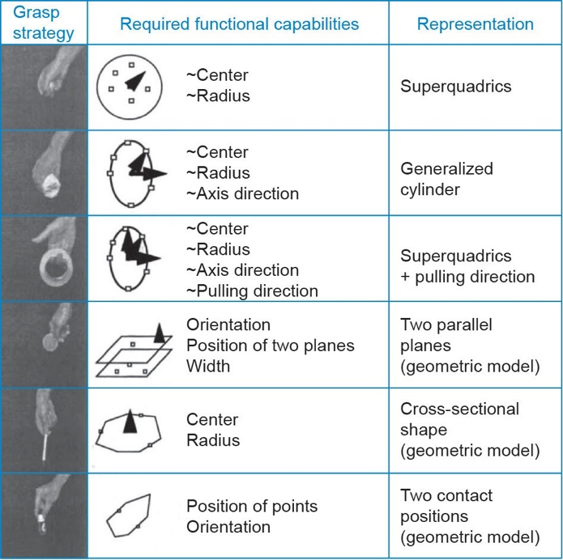
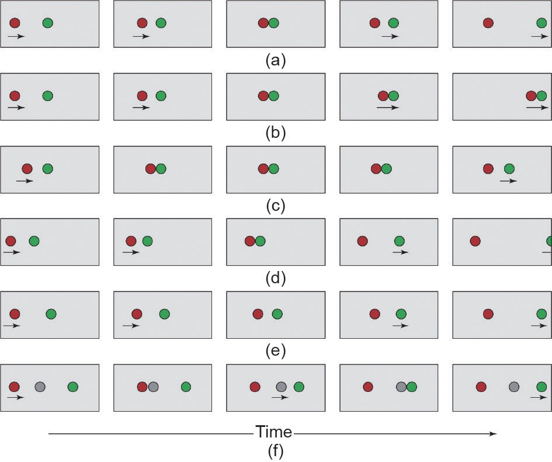
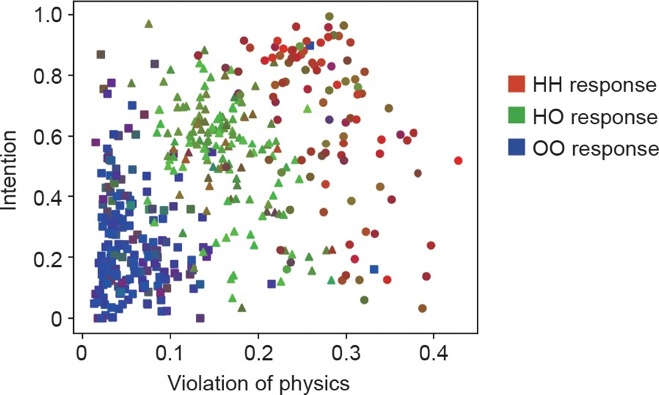
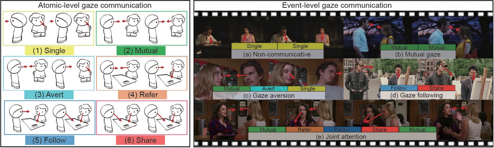
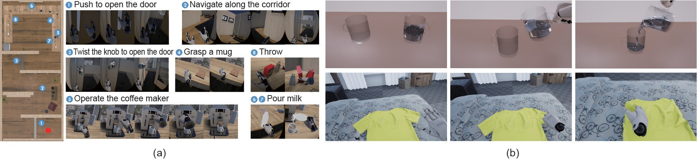

## “暗”，不止于“深”——迈向认知智能与类人常识的范式转换

 

 

**摘要**：近年来，深度学习的研究进展本质上是基于“以大数据驱动小任务”的范式，其依靠的是通过大量数据训练的分类器解决一项单一的任务。本文中，我们提出将范式中数据和任务的关系颠倒。在“以小数据驱动大任务”的新范式下，只有少量数据的单一人工智能系统便可以发展出“常识”，并且 用“常识”来解决各种任务。通过回顾综合了机器与人类视觉常识模型的最新突破，我们将阐释这个新范式的潜力。我们将功能性（functionality）、物理（physics）、意图（intent）、因果（causality）和效用（utility）（FPICU）认定为拥有类人常识的认知人工智能的5个核心领域。对于视觉理解， FPICU超越了传统的“是什么”和“在何处”的问题框架，而聚焦于“为什么”和“怎么样”。这 些问题在像素层面上并不可见，却促进了视觉场景的创建、维护和发展。因此，我们将它们称为视觉的“暗物质”。正如仅仅研究可观察到的物质不足以理解宇宙，我们认为不研究学习FPICU等“暗物质”就无法理解视觉。本文通过展示如何在少量训练数据的条件下观测和应用FPICU来广泛完成一系列挑战性任务，从而证明这个新观点具有开发类人常识的认知智能的能力。这些任务包括工具使用、规划、效用推断和社交学习。总而言之，为了完成未曾见过的任务，下一代人工智能技术必须具备类人常识的“暗物质”。

 

**关键词**：计算机视觉、人工智能、因果、直觉物理、功能性、主观意图效用

 

## 1.  呼吁视觉与人工智能的范式转变

计算机视觉是人工智能的门户，也是现代智能系统的主要组成成分。根据先驱大卫·马尔[1]提出的经典定义：“计算机视觉的首要任务是感知‘什么’在‘何处’”。“什么”指的是物体识别（物体视觉），而“何处”指的是三维重建和物体定位（空间视觉）[2]。这一定义对应人脑中的两条神经通路。①腹侧神经通路：负责物体和场景的类别识别；②背侧神经通路：负责景深和形状的重建、场景布局的表征，以及视觉引导下的动作等。此范式引领了20世纪80~90年代计算机视觉领域中基于几何的方法，以及过去20年基于外观特征的方法。

近几年来，硬件加速和大量可用的标注数据推动了深度神经网络（deep neural network, DNN）的快速发展， 进而助力了物体检测与定位技术的进步。然而，我们距离解决计算机视觉问题和真正的机器智能问题依然很远。当前的计算机视觉系统的推理能力范围狭窄且高度特异化，需要针对专门任务设计大型标注数据集。同时，这样的视觉系统缺乏对物理世界与社交世界运作常识的理解，而这些常识对于普通成年人是显而易见的为了填补现代计算机视觉和人类视觉之间的空白，我们必须找到一个更广阔的视角，从中对缺失的维度（即类人常识）进行建模和推理。

我们当前对于视觉的理解类似于宇宙学和天体物理学领域中观测到的宇宙。在20世纪80年代物理学家提出的标准宇宙学模型中，通过电磁波谱观察到的质能仅 占不到5%的宇宙部分，而宇宙的其余部分则是暗物质（23%）和暗能量（72%）。暗物质和暗能量的性质和 特点无法被直接观察到，必须使用复杂模型从可见的质能中推断得出。虽然它们不可见，但是暗物质和暗能量有助于解释可见宇宙的形成、演化和运动。

我们希望借用这一物理学概念，来提升视觉界及其他领域对于这些缺失的维度以及其联合表征和联合推理的潜在好处的认知。我们认为，人类之所以既可以从稀疏而高维的数据中得出丰富的推论，又可以从一张图片中获取深刻的理解，都是因为我们拥有普遍但是无法用视觉感知的知识，而它们永远无法仅仅通过询问“什么” 和“何处”来理解。具体来说，人造物体和场景的设计中暗含了潜在的功能，而这些功能由不可直接观测的物理定律及其引申出的因果关系决定。例如，思考一下我们对于从水壶中流出的水的理解，或者我们关于诸如玻璃之类的透明物质可以用作坚固的桌子表面的知识，告诉我们图1中发生了什么。

图1.一个通过联合解译和认知推理深入理解场景或事件的示例。从单一图像中，计算机视觉系统应该能够同时进行以下工作：①重建3D场景；②估算相机参数、材料和照明条件；③以属性、流态和关系对场景进行层次分析；④推理智能体（如本例中的人和狗）的意图和信念；⑤预测它们在时序上的行为；⑥恢复不可见的元素，如水和不可观测的物体状态等。作为人类，我们可以毫不费力地做到：①预测水壶中将会有水流出；②推理出番茄酱瓶倒置背后的意图——为了利用重力、方便使用；③看到狗下有一个用现有计算机视觉方法很难检测到的玻璃桌；如果看不到这个玻璃桌，视觉解析结果将因为狗看上去漂浮在空中而违反物理定律。这些知觉加工只能通过推理场景中没有以像素表示的不可观察因素来得到。这要求我们构建具有类人核心知识和常识的人工智能系统，而当前的计算机视觉研究严重缺失这些知识。

同时，人类活动特别是社交活动，是由因果、物理、功能、社交意图、个人喜好和效用支配的。在图像和视频中，许多潜在的、未以像素表示的实体（比如功能性物体、流体、物体流态，意图） 和关系（比如因果效应、物理支撑、意向和目标）无法通过大多数现有的、仅考虑外观的方法进行检测。然而， 它们无处不在，并且支配着当前方法相对容易检测的可见实体的位置和运动。这些不可直接观测的因素在最新的计算机视觉研究中严重缺失，大多数的视觉任务被转换为分类问题，并通过大规模的标注数据和端到端的神经网络训练来解决。我们称这种计算机视觉与人工智能领域中的范式为“以大数据驱动小任务”的范式。

在本文中，我们旨在吸引研究者们关注一个具有巨大希望的新方向——将“暗”实体和关系整合到视觉与人工智能研究中。通过推理可见像素以外的不可见因素，我们可以近似人类的常识，使用有限的数据来实现各种任务的范化。这些任务包括并融合了经典的“什么” 和“何处”问题（即分类、定位和重建）和“为什么、 如何以及如果”问题（包括但不限于因果推理、直觉物理、学习功能性和可供性、意图预测，以及效用学习）。 由此，我们称这种范式为“以小数据驱动大任务”的新型范式。

当然，众所周知，计算机视觉是一个不适定的求逆问题[1]，其中仅有像素是可以直接看到的，而其他任何东西都是隐藏的。“暗”这个概念与视觉和概率模型中常用的“隐”是正交的，并且含义更加丰富。“暗” 是对于除可见外观或几何形状之外还需要多少不可见常识来分类物体或推断关系的相对难度的度量。实体可以落在连续的“暗”频谱上：从普通人脸等根据外观相对容易识别（因而被认为是“可见的”）的物体，到椅子等因为类内差异较大而难以识别的功能性物体，再到各种无法通过像素识别的实体或关系。考虑图1中的例子：智能体的性别是“隐”的，因为不需要利用意图、因果或者其他不可见因素的理解来揭示它。对比之下，水壶的功能是“暗”的；通过常识，人可以轻松推断出水壶内部有液体。番茄酱瓶的位置也可以被认为是“暗”的， 因为对典型人类意图的理解使我们得知番茄酱瓶的颠倒放置是在利用重力作用以便于倒出。

本文其余章节将做如下安排：在第2节中，我们从“是什么”和“在何处”的角度重新审视计算机视觉领域的经典观点，并揭示人类视觉系统本质上是任务驱动的，而视觉表征和计算机制扎根于各种任务中。为了使用“小数据”解决“大任务”，我们认定并回顾了视觉常识的5个关键维度：功能性（functionality）、物理（physics）、意图（intent）、因果（causality）和效用（utility）（FPICU）。因果（详见第3节）是智能理解的基础。因果关系的运用（例如第4节中的直觉物理）使人类拥有理解我们身处的物理世界的能力。功能性（详见第5节） 则是人类为达成特定目的而与物理环境互动时所必须拥有的对环境的深入理解。在考虑物理世界之上的社交互动时，人类需要进一步推断意图（详见第6节）以了解其他人的行为。最终，随着对物质世界和社交世界的知识积累，理性智能体的决策是由效用（详见第7节）驱动的。在一系列研究中，我们证实了“暗实体”和“暗关系”的5个关键维度的确支持了包括分类在内的各种视觉任务。我们在第8节中总结并讨论了我们的观点。 我们认为人工智能的未来发展不应只是提高数据驱动方法的性能和复杂性，掌握这些不可见的本质成分才是至关重要的。

## 2.  视觉——从数据驱动到任务驱动

视觉系统应该为其服务的智能体提供什么？从生物学的角度来看，大多数生物都运用单一视觉系统（具有多个模块）执行数以千计的任务。与之形成鲜明对比的， 则是当今计算机视觉研究中的主流思路——单一模型专门针对单个任务而设计。在计算机视觉文献中，这种在多种任务之间进行泛化、适应和迁移的有机范式被称为以任务为中心的视觉[3]。在图2 [4]展示的厨房中，即使是调一杯咖啡这样简单的任务也包含多个子任务，包括查找物体（物体识别）、抓取物体（物体操控）、在冰箱中寻找牛奶并添加糖（任务规划）。先前的研究表明，人可以利用单一视觉系统促进各种子任务的完成[4]， 在1min内完成一杯咖啡的调制。

图2.即使对于沏一杯茶这样的简单任务，人也可以利用单一视觉系统执行各种子任务，以达到最终目的。（a）在一个小型矩形厨房中执行同一沏茶任务时对于3个不同被试者的视觉注视记录；（b）从眼动录像带中得出的注视方式示例；（c）沏茶过程中的一系列视觉和运动事件。Rot：旋转； ktl：水壶。

神经科学研究也表明了类似的结果：人类视觉系统比任何现有的计算机视觉系统都具有更强大的功能，并且不局限于记忆像素中的模式。例如，Fang和He [5]的研究表明，人类识别一张图像中的人脸与识别可作为工具操作的物体的机制不同（图3）。这一研究结果显示人类对于工具外观的视觉反应甚至可能比对面部的视觉反应更为灵敏和强烈。这驱使着我们思考有多少关于物体如何帮助执行任务的推理是植根于视觉智能的。其他研究[6]也支持类似的结论——不需要明显的动作，仅仅是工具的静态图像就可以“增强”动作。综上这些研究结果，我们的生物视觉系统拥有一种感知物体功能（即如何将物体作为工具进行操纵）的机制，而且该机制独立于控制人脸识别（以及对其他物体的识别）的机制。所有这些研究结果都呼吁我们继续探索人类视觉系统和自然智能的奥秘。

图3.人脑背侧和腹侧通路对于不可见物体的皮层反应。（a）实验刺激（工具和面部）和实验程序；（b）背侧和腹侧脑区都对工具和面部有反应，当刺激被高对比度的动态纹理抑制时，背侧区域仍然对工具有反应，但是对面部没有反应，而工具和面部都没有在腹侧区域 唤起显著激活。

### 2.1.   “是什么”——以任务为中心的视觉识别

正如20世纪70年代Potter [7,8]以及90年代Schyns和Oliva [9]及Thorpe [10]所观察到的，人脑可以在200ms内掌握一张图像中场景的“要点”。研究人员通常根据这一系列研究工作将分类问题当作数据驱动过程[11– 15]，主要是在前馈网络架构中[16,17]。这种思路推动了过去10年中计算机视觉和机器学习领域中的图像分类研究，并使其取得了显著进展（包括近来成功的深度神经网络[18–20]）。

尽管这些方法在公开数据集上的场景分类任务中表现出了良好的识别准确度，最近的一项大规模神经科学研究[21] 显示，当前的深度神经网络无法解释灵长类动物（包括人类和猴子）的图像级行为模式。这需要更多的研究来更精确地解释灵长类动物物体视觉的神经机制。此外，数据驱动方法已将场景分类研究的关注点从视觉信息的重要决定因素，也就是分类任务本身[22,23] 转移开。同时，在这些方法中，分类与场景的语义信息互动并实现认知推理的机制尚不明确。 心理学研究表明，即使在“简单”的分类识别任务中， 人类视觉也会在推理过程中构建表征。根据观看者的需求（和任务目标），视觉可以将厨房分类为一种室内场景、烹饪场所、社交场所或者是个人拥有的厨房（详见图4 [24]）。如参考文献[24] 所示，场景分类和信息收集过程会受到这些分类任务的约束[25,26]，表明视觉输入与观看者的需求/ 任务目标之间存在双向的相互作用[23]。除了场景分类，在面部识别中也观察到了类似的现象[27]。

图4.参考文献[24]中的实验，展示了自上而下和自下而上的信息之间的诊断驱动的双向交互作用，用于特定层次水平的场景分类。（a）在给相同场景输入图像的情况下，如果要求对象将场景分类为基本水平（如餐厅）（b）或下位水平（如自助餐厅）（c），被试对象将表现出不同的注视方式，这说明了场景分类是任务驱动的。

在早期的工作中，Ikeuchi和Hebert [28]受到机器人抓握研究的启发，提出了一种以任务为中心的表征。具体而言，在无需恢复详细的3D模型的情况下，他们的分析表明，不同的抓握策略源于物体提供的不同功能； 因此，同一物体的表征可以根据规划的任务而变化（参见图5 [28]）。例如，握住杯子可能会导致两种不同的握法——握住杯子主体的圆柱形抓握和握住杯子手柄的钩抓握。这些发现还表明，视觉（在这种情况下是指识别可握住的部分）很大程度上受任务驱动；不同的任务导致不同的视觉表征。

图5.不同的抓取策略依托于不同的功能。

### 2.2.    “在何处”——将 3D 场景的构建作为一系列的任务

在相关文献中，3D机器视觉通常假定的目标是从摄像机/观察者的角度构建一个准确的3D场景模型。这些运动恢复结构（structure-from-motion, SfM）和同步定位与建图（simultaneous localization and mapping, SLAM）方法[29]已成为3D场景重建中的主要范例。这其中，从单张二维（two-dimensional, 2D）图像进行三维场景重建是一个众所周知的不适定问题——可能存在与投影的2D观察图像相匹配的无限数量的3D构造[30]。 但是，此处的目标不是精确求解真实的3D构造，而是使智能体通过在功能、物理和物体关系方面生成最佳的可能构造来执行任务。直到最近[31–38]，大部分相关工作还是独立于识别和语义方面来研究的（参见图6 [36] 的示例）。

图6.以合成分析的方式[36]对3D室内场景进行解析和重构的图示。3D表征由单独的视觉任务（如物体检测和2D布局估计）进行初始化。 联合推理算法通过比较渲染的法线、深度和分割图与直接从输入RGB 图像估计的结果之间的差异，迭代地调整3D结构。

重建“ 认知地图” 这一想法已有很长一段历史[39]。然而，我们的生物视觉系统不依赖于特征和变换的精确计算；现有大量证据表明，人类以一种根本不同于当前任何计算机视觉算法的方式来表征场景的3D结构[40,41]。实际上，多项实验研究并不支持全局度量表征[42–47]；人类视觉在定位上容易出现错误和失真[48–52]。在一项案例研究中，Glennerster等[53]发现若观察者在移动的同时执行着各项任务，那他对于周围环境规模的急剧变化的不敏感程度十分令人惊讶。

在所有近期的证据中，网格细胞可能是印证了无需为视觉任务进行精确3D重建的最著名的发现[54–56]。 网格细胞对欧几里得空间的认知表征进行编码，暗含着不同的对位置和方向的感知和处理机制。这项发现后来被授予2014年的诺贝尔生理学或医学奖。令人惊讶的是，这种神经机制不仅存在于人类[57]中，还存在于小鼠[58,59]、蝙蝠[60]和其他动物中。Gao等[61]和Xie等[62]提出了一种网格细胞的表征模型，其中智能体的二维自我位置由高维向量表征，主体的二维自我运动或位移由转换这一向量的矩阵表征。这种基于矢量的模型能够通过错误纠正、路径积分和路径规划来学习网格细胞的六边形模式。最近的一项研究也表明，在一些特定的人类导航任务中，基于视角的方法实际上比基于3D重建的方法表现得更好[63]。

尽管有这些发现，我们如何在复杂环境中导航的同时保持返回原始位置（归家）的能力，仍然是生物学和神经科学领域中的一个谜团。Vuong等[64]的近期研究为空间的任务相关表征提供了证据，或许可以带来一些启发。具体而言，在此实验中，参与者引起了较大且一致的、难以被任何单一3D表征解释的指向误差。他们的研究表明，维持视觉方向以达到看不见目标的机制既不是基于稳定的3D场景模型，也不是基于其畸变。相反，参与者似乎是塑造了一个扁平的、与任务相关的表征。

 

### 2.3.     不止于“是什么”和“在何处”——迈向基于类人常识的理解场景

心理学研究表明， 人类的视觉体验比“ 是什么” 和“在何处”要丰富得多。早在婴儿时期，人类就能迅速有效地感知因果关系（例如，感知到物体A发射了物体B）[65,66]、智能体和意图（例如，理解一个实体正在追逐另一个实体）[67–69]，以及物理力的后果（例如，预测不稳定的岩石堆将朝特定方向掉落） [70,71]。人类对诸如此类的社交和物理概念的感知既可以通过例如视频[72] 的信息稠密媒介获得，也可以通过更加稀疏的视觉输入[73,74] 获得，参见图7中的示例。

为了使人工智能体具有类似的功能，我们倡导一个基于联合表征的联合推理算法，该联合表征将整合：① 物体、场景、动作、事件等“可见的”传统识别类别；②“暗”的高阶认知概念：流态、因果、物理、功能性、可供性、意图/目标、效用等。这些概念又可以分为5个轴：流态和主观因果、直觉物理、功能性、意图和目标， 以及效用和偏好，如下所述。

图7.（a）动画展示了智能体的意图、情绪和角色[73]。（a）在二维平 面上移动的4个不同的圆盘的运动和相互作用受潜在的物理属性和动力学定律（如质量、摩擦、全局力和成对力）的支配；（b）关于场景动态的直觉理论和反事实推理[74]，台球A和B碰撞的示意图，其中 实线表示球的实际运动路径，虚线表示如果场景中不存在A球，B球 将如何移动。

 

### 2.3.1.   流态和主观因果

流态是由艾萨克·牛顿（Isaac Newton）[75]和Ma- claurin [76]提出，并被人工智能和常识推理[77,78]采用的概念，它是指物体随时间变化的瞬态，比如杯子空着或被倒满、门上锁、车灯闪烁以指示左转、电话铃响等；有关图像中“暗”流态的其他示例，请参见图8。流态与心理学研究中的主观因果是相关的[79]。即使是视觉体验有限的婴儿，也天生具有从日常观察中学习因果关系的能力，而这一能力引导着他们对事件语义信息进行深入理解[80]。

图8.水和其他清澈的液体在人类的日常生活中起着重要的作用，但在图像中几乎检测不到。（a）水只会引起外观上的微小变化；（b）用虚线表示的“暗”实体：水、流态（此处为由三角形表示的杯子和水龙头）以及人的意图，动作（菱形）牵涉了智能体（五边形）和杯子（圆圈  里的物体）。

流态和主观因果不同于物体的视觉属性[81,82]，后者在观察过程中是永久的。例如，在短视频片段中，人的性别是一种属性，而不是流态。一些流态是可见的， 但很大一部分流态是“暗”的。人类认知具有先天的认知能力（在婴儿中可观察到）[80]和强烈的内在倾向， 以感知动作与流态的变化之间的因果关系。例如，意识到拨动开关可导致灯被打开。要认识到由动作引起的物体变化，我们必须要能够感知和评测一个物体可变化的特性；因此，感知流态（比如电灯开关被设置为上方还是下方的位置）对于识别动作和了解事件的发展至关重要。大多数关于动作识别的视觉研究都非常关注人体在行走、跳跃和拍手等活动过程中的位置、姿势和运动，以及诸如饮酒和吸烟等姿势与物体之间的交互作用[83–86]。但是大多数日常动作（如开门）是由因果关系决定的（门从“关闭”变为“打开”这个过程中流态的变化，无论它是如何被打开的），而不是由人的位置、位移或空间-时间特征[87,88]决定的。相同地，诸如穿衣服或搭帐篷之类的动作不能只通过其外观特征来定义。它们的复杂性需要通过因果关系来理解。总体而言，场景的状态可以看作是记录动作历史的流态的集合。然而，尽管流态和因果推理在图像和视频中普遍存在，它们尚未在机器视觉中被系统地研究过。

 

### 2.3.2.     直觉物理

心理学研究表明，近似牛顿法则是人类判断动力学和稳定性的基础[89,90]。Hamrick等[71]和Battaglia等[70]的研究表明，牛顿原理和概率表征的知识被广泛应用于人类的物理推理，而直观物理模型是达到人类水平的复杂场景理解的重要组成部分。其他研究表明，对于场景中的物体，人类会十分敏锐地观察到场景中的物体 违反某些已知的物理关系，或者是否看起来在物理上不稳定[91–95]。

不可见的物理场掌控着人造场景中物体的布局和摆放。通过人为设计，物体应在面对重力和其他各种潜在干扰因素[96–98]（如地震、阵风或人为动作）时保持稳定和安全。因此，任何3D场景的理解或解析（如物体定位和分割）都必须在物体规律上具有合理性[36,96–100]（图9）。这一观察为场景理解设定了有效的约束条件，对于机器人应用十分重要[96]。例如，在救灾现场的搜救任务中，机器人必须能够推断各种物体的稳定性，以及哪些物体支撑着其他物体，然后再基于这些信息谨慎工作，避免造成更多危险干扰。理解稳定性对于这一应用以及许多其他机器人应用至关重要。

图9.推断物体因人类活动和自然干扰而掉落的可能性。（a）想象的人类轨迹；（b）首要运动空间的分布；（c）次要运动区域（；d）通过整合首要动作与次要动作而建立的综合人类运动区域。5个物体a~e都是典型的干扰场：与其他对象（如桌子中央的物体a、在桌子下面的物体e以及在  房间凹角的物体d相比，桌子边缘的物体b和沿路径的物体c（以意外碰撞的形式）表现出更大的受扰动可能。

 

### 2.3.3.   功能性

大多数人造场景的设计是为了满足多种人类功能， 如坐着、吃饭、社交和睡觉，并且满足人类对这些功能的需求，如照明、温度控制和通风。这些功能和需求在图像中是看不见的，但是它们塑造了场景布局[34,101]、 几何维度、物体形状以及其材料选择。

通过功能性磁共振成像（functional magnetic reso-nance imaging, fMRI）和神经生理学实验，研究人员发现了前运动皮层区域中的镜像神经元。这些神经元被认为是编码了人与物体和场景交互的动作[102]。人脑中的概念不仅可以由原型（即当前计算机视觉和机器学习方法中的示例）表征，也可以由功能表征[80]。

 

### 2.3.4.   意图和目标

认知科学的研究[103]表明，人类强烈地倾向于将事件解释为由智能体意图所驱动的一系列目标。这样的目的论立场启发了认知科学文献中将意图估测作为一种逆规划问题的一系列模型[104,105]。

我们认为意图可以被视为智能体（人类和动物）的短暂状态，如“口渴”“饥饿”或“疲倦”。它们与物体的流态相似，但比其更加复杂，并且具有以下特征：①它们按一系列目标进行层级组织，是驱动一处场景中 动作和事件的主要因素；②它们完全是“暗”的，即无法用像素表示；③与响应动作的流态的即时变化不同，意图通常是在较长的时空范围内形成的。例如，在图10 [72]中，当一个人饿的时候在院子里看到了一辆餐车，他决定（打算）走向那辆车。在这个过程中，一种远距离的吸引关系被建立。本文随后将对此进行说明，每个功能性物体（如餐车、垃圾桶或自动售货机）都会在场景中发出一个与重力场或电场非常类似的吸引场。因此，一个场景具有许多层的吸引或排斥场（如难闻的气味或者禁止踩踏的草丛），这些场完全是“暗”的。有某种意图的人在这些场中的轨迹遵循拉格朗日力学中的最小作用量原理，即通过最小化随时间积分的势能和运动能推导出所有运动方程。

图10.人们的轨迹被颜色编码，以表示他们的共同目的地。三角形代表目的地，点则代表起点；例如，人们可能正走向餐车去购买食物（绿色），或者正要去自动售货机买饮料解渴（蓝色）。由于分辨率低、照明条件差，以及被遮挡住，仅根据其外观和形状很难检测出位于目的 地的物体。

意图和目标的推理对于以下视觉和认知任务至关重要：①事件和轨迹的早期预测[106]；②通过分析人体轨迹发现不可见的物体吸引/排斥场并识别其功能[72]；③通过功能和活动来理解场景[25]，其中吸引场在场景中的辐射范围比近期研究中的功能图[26,107]和可供性图[108–110] 更大；④理解一群人之间的多方面关系以及他们的角色[111–113]；⑤理解和推断智能体的心理状态[114,115]。

 

### 2.3.5.   效用和偏好

给定智能体与3D场景进行交互的一幅图像或一段视频，我们通常可以假设观察到的智能体会做出接近最优的选择，来最大限度地减少任务成本。也就是说，我们可以假设，在这个过程中智能体没有欺骗或矫饰，这就是所谓的理性选择理论，即一个理性人的行为和决策是通过最大化其效用函数来驱动的。在经济学和博弈论的机制设计领域里，此理论与显示原理有关。在显示原理中，我们假设每个智能体如实报告自己的偏好（参见 文献[116]中简短的介绍性综述）。建立人类效用的计算模型可以追溯到英国哲学家杰里米·边沁（Jeremy Ben- tham），以及他关于功利主义的伦理学著作[117]。

通过观察理性人的行为和选择，我们可以对他们的推理和学习过程进行逆向工程，并估算出他们的价值观。效用（或价值）也被用于人工智能（artificial intel- ligence, AI）领域的规划体系中[例如，马尔可夫决策过程（Markov decision process, MDP）]，并且通常与任务状态相关。然而，在MDP的相关文献中，“价值”无法反映真实的人类偏好，但却紧密依赖于智能体的行为[118]。我们认为，这种效用驱动的学习可能比计算机视觉和人工智能领域中的传统监督学习更加稳定。

 

### 2.3.6.   小结

FPICU的5个域尽管看上去有明显的不同，但是它们之间有理论上的重要联结。这些相互联结具有以下特征：①5个FPICU域通常不容易投射到明确清晰的视觉特征上；②大多数现有的计算机视觉和人工智能算法都对这些域无能为力，（在大多数情况下）也根本不适用；③人类视觉在这些域中仍然非常高效，而且人类水平的推理往往基于FPICU的先验知识和能力。

我们认为，如果将这5个关键要素结合在一起，将至少可以在3个方面推动视觉或人工智能系统的发展。

1、泛化。作为更高阶的表征，FPICU的概念在整体的人类生活空间中基本上是全局不变的。因此，在一个场景中学习到的知识可以迁移到新的情境中。小样本学习。为了理解环境、事件和智能体的行为，FPICU对必要的先验知识进行编码。由于FPICU比外观或几何特征更加稳定，即使没有大数据， FPICU也可以跨领域和数据源进行更一致且不受噪声困扰的学习。

2、双向推断。使用FPICU进行推理需要将基于抽象知识的自上而下的推理，与基于视觉模式检测的自下而上的推理结合起来。这意味着系统不仅会继续像现在一样，通过观察以像素表示的可见场景进行数据驱动推理，还要基于FPICU的理解进行推理。这两个过程可以互相促进，从而提高系统的整体表现。在随后的5个章节中，我们将会十分详细地讨论这5 个关键要素。

 

## 3.             因果感知和推理——深入理解的基础

因果关系是由我们所感知的环境产生的关于原因和结果的抽象概念。因此，因果关系可以用作构造时间和空间概念的先验基础[119–121]。人们对原因有与生俱来 的假设，且因果推理几乎可以被完全自动且不可抗拒地激活[122,123]。我们认为，因果是其他4个FPICU要素（物理、功能、意图和效用）的基础。例如，一个智能体必须能够推理出他人行为的原因，以便理解他人的意图。它也必须能够理解自己的行为可能造成的影响，以便更恰当地使用功能性物体。在一定程度上，人类的很多理解都取决于理解因果关系的能力。如果不理解导致某个动作的原因，我们很难想到接下来可能发生什么，并及时且恰当地响应。

在本节中，我们首先简要回顾心理学领域中关于因果感知和推理的研究，随后回顾统计学习领域中类似的研究工作。我们以计算机视觉和人工智能领域中对于因 果学习的案例研究作为本节的结尾。

### 3.1.      人类的因果感知与推理

人类通过高阶认知推理来思考因果关系。但是我们能否像看到颜色和深度那样，直接从视觉中“看到”因 果？通过一系列的行为实验，Chen和Scholl [124]的研究表明，人类视觉系统可以通过常识性的视觉推理来感知因果历史，并且可以根据推断出的潜在因果历史来表征物体——本质上就是通过思考“它们是如何变成这样的”来表征形状。因果关系本身不能直接从视觉本身解释；一个智能体只有站在远端世界才能理解因果关系[125]。

早期的心理学研究侧重于将一种关联机制作为人类因果学习和推理的基础[126]。在这段时间里，Rescor-la-Wagner模型被用来解释人类（和动物）如何利用一同出现的知觉刺激来预期即将发生的事件[127]。但是，最近的研究表明，人类因果学习是一种理性的贝叶斯过程[125,128,129]。这种学习涉及了抽象因果结构的获取[130,131]和因果关系的强度值[132]。

最早对于因果感知的系统性研究来自于心理学家Michotte [79]对一个台球（A）撞击另一个台球（B）的观察；详细说明见图11 [133]。在经典演示中，球A在碰到B的瞬间停止，而B立即开始以与A相同的速度运动。这种视觉展示不仅描述了运动，还描述了A“发射”B 的因果相互作用。这种“发射效应”的感知具有一些值得注意的特性，下面我们将对其进行列举，文献[133]中有更加详细的综述。

1、不可抗拒性。即使一个人被明确告知A和B只是不能进行机械交互的像素块，人们仍然像被迫使一般感知到是A发射了B。人们无法忽略明显的因果关系， 就像无法无视颜色和深度一样。被运动的时空模式紧密控制。仅在A的停止和B的启动之间增加一个很小的时间间隔，人们就会失去对发射效应的感知，B的动作就将被视为是自发的。

2、丰富性。即使是两个球的相互作用也可以支持多种因果效应。例如，如果B的移动速度比A的移动速度快（相比于A与B的移动速度相同），人们便不会感知到A“触发”了B。主观因果还包括“夹带”——只是 在表面上与发射相同，而实际上有一个明显的区别：A 在触碰到B后，继续与B一起运动。

图11.Michotte对于感知因果的一些基本示例，关于对两个物体A和B（此处显示为红色和绿色圆圈）的感知。（a）发射效应；（b）夹带效应—— A似乎与B一起向前；（c）通过在A和B的运动之间添加一个短暂的时间间隔来消除发射效应；（d）触发效应——尽管是由A引起的，B的动作却被视为是自主的；（e）在A的最终位置和B的初始位置之间增加空间距离也消除了发射效应；（f）工具效应——中间物体（灰色圆圈）看上去只是A用来触动一连串动作的一种工具。这些只是人类直观理解的物体之间众多因果关系中的一部分，而AI必须学会识别这些因果关系。

近来的认知科学研究[134]提供了更加引人注目的证据：人的视觉在因果关系中植根之深，使得色彩和因果之间的类比更加强烈深刻。在人类视觉科学中，“适应”是指观察者在持续观察一段时间后适应刺激源，从而对这些刺激源的知觉反应变弱的现象。在某种特殊类型的适应中，刺激源必须在由视网膜和视觉皮层共享的参照系中出现在相同的位置上。这种类型的视网膜适应已被视为对刺激源的早期视觉处理的有力证据。例如，众所周知的由颜色感知引发的视网膜适应[135]。令人惊讶的是，最近的证据表明，视网膜适应也发生于因果关系的感知中。在长时间观察触发效应之后，只有当随后观看的演示位于相同的视网膜坐标时，观察者才会更高频地将它判定为非因果关系这意味着物理上的因果关系在早期视觉处理阶段就已经被提取。将视网膜适应作为一种工具后，Kominsky和Scholl [136]最近探索了发射与夹带（A球触碰到B球后一起移动）是否属于本质上完全不同的范畴。结果表明，视网膜的特异性适应 在触发和夹带之间没有迁移，说明了在视觉中的确存在着本质上不同的因果感知范畴。

因果感知的重要性不仅仅是在不同的因果事件上贴上标签。因果关系的一项独特功能是支持反事实推理。观察者利用他们的反事实推理能力来解释视觉上的发现。换句话说，解释不仅基于观察到的内容，而且也基于本应当发生但未发生的事情。在一项研究[137]中，参与者观看了移除了目标球去向的台球撞击视频，并被要求判断一个台球是引起另一个球运动还是阻止其通过出入口。参与者的观看方式和判断表明，他们模拟了从场景中被移除的部分。参与者越确定结果会有所不同， 他们对因果关系的判定就越强。这些结果清楚地表明，自发的反事实模拟在场景理解中起着至关重要的作用。

 

### 3.2.   因果迁移——机器智能的挑战

尽管以上所有证据都证明了因果在人类视觉中起到重要而独特的作用，但是在研究中仍然存在着很多关于因果理解对于高级机器智能是否必要的争论。但是，理解因果概念对于预期在具有共同隐藏机制的观测变化域中运作的智能体而言至关重要。具体而言，我们在地球上的环境严格遵守着相对恒定的环境动力学，例如恒定的重力。也许更重要的是，我们世界的大部分是由他人设计的，并且在很大程度上遵循常见的因果概念：开关可以打开和关闭物件，旋钮可以打开门，等等。即使处于不同场景中的物体看起来有所不同，它们的因果效应也因为符合一致的因果设计而保持不变。因此，对于预期在人为设计但不断变化的环境中工作的智能体而言，能够学习可泛化和可转移的因果理解至关重要。深度强化学习（reinforcement learning, RL）一类的系统近来十分流行，并被广泛应用[138–142]，但是其中的绝大多数都没有学习明确的因果关系。这给在当今主导的机器学习范式[143,144]下的迁移学习带来了巨大挑战。解决此挑战的一种方法是学习环境的因果编码，因为因果知识本就编码了世界的可迁移表征。假设世界的动态是恒定的，因果关系就一直是真实的，且与观察到的环境变化（如更改对象的颜色、形状或位置）无关。

在一项研究中，Edmonds等[131]提出了一个复合的分层任务，要求人类对抽象的因果结构进行推理。这项工作提出了一套虚拟的“密室逃脱”，智能体必须操纵一系列的杠杆来打开一扇门（参见图12 [131]中的示例）。值得注意的是，此任务在设计的时候，就希望通过要求智能体找到所有逃离房间的方法（不只有一种方法），以促使其形成对逃离房间因果结构的内在表达。这一工作使用了三杆和四杆的房间以及两个因果结构：共同原因（common cause, CC）和共同结果（common effect,CE）。这些因果结构将不同的组合编码为房间的锁。在完成一个房间的任务之后，智能体被放置到一个新的房间中。在这个新的密室中，虽然可感知的环境发生了变化，但是其蕴含的抽象的、隐藏的因果结构保持不变。为了重新利用在之前房间中获取的因果结构信息，智能体需要快速学习其对新环境的感知，以及与相同潜在因果结构之间的关系。最后，在实验结束时，智能体被放到一个又加了一把杠杆的房间中。这个新房间可能遵循与之前相同（一致）或不同（不一致）的因果结构，以检验智能体否可以将其获得的知识泛化到更复杂的情境中。此任务设置是独特且具有挑战性的，主要有两个原因：①在房间之间转移智能体，测试了它是否形成了环境的抽象表征；②在三杆房间和四杆房间之间的转移则考察了在相似但不同的因果情景中，智能体对因果知识的适应程度。

图12.参考文献[131]中展示的开锁任务。（a）三杆试验的初始配置。 所有操纵杆都被拉向机械臂，机械臂的基座固定在显示屏的中央。机械臂通过向外推动或向内拉动与杠杆产生相互作用。这可以分别通过点击杠杆径向轨道的外部或内部区域来实现。在每种锁定情况下，事实上只需要一系列推的动作即可解锁门。浅灰色的杆始终处于锁定状态，人类受试者和受训于强化学习（RL）的智能体在训练开始时对此都不知情。门解锁后，可以单击绿色按钮来指示机械臂将门推开。 位于门红色铰链对面的黑色圆圈表示门锁指示器：如果已锁定则显示，如果未锁定则不显示。（b）推杆。（c）单击绿色按钮打开门。

 

在表面不同但结构相同的因果环境下，人类受试者表现出非凡的获取和转移知识的能力（见图13 [131,145]中的比较）。在一致和不一致的情况下，人类表现都趋近于最佳性能，并在增加了一根杠杆的房间中表现出正向的迁移效应。对比之下，近来的深度强化学习方法无法解释必要的因果抽象化，并且显示出负向的迁移效应。这些结果表明，在当前机器学习范式下运行的系统 无法学习适用而抽象的环境编码。也就是说，它们并没有学习抽象的因果编码。因此，我们将从感知和交互中 学习因果理解视为当前人工智能系统面临的一种“暗物质”，应在以后的研究工作中对其进行进一步探讨。

 

 

图13.学习因果的人和典型的强化学习智能体之间的比较[145]。共同原因4（CC4）和共同结果4（CE4）表示Edmonds等使用的两种迁移条件[131]。（a）人类参与者在四杆CC4（左）和CE4（右）条件下寻找所有不同的解决方案所需的平均尝试次数，表明学习后有正向的因果迁移。浅灰色和深灰色条分别代表“CC3”和“CE3”条件下的训练。 误差棒表示平均值的标准误差。（b）相反，强化学习智能体难以通过迁移所学知识来解决类似任务。基线（无迁移）结果表明，到CC4 和CE4的基线训练结束时，性能最佳的算法[近端策略优化（proximal policy optimization, PPO）和信任区域策略优化（trust region policy optimization, TRPO）]分别成功完成10次和25次尝试。异步优势动作评价算法（advantage actor-critic, A2C）是唯一呈现出正向迁移的算法；A2C在CC4条件下的训练中表现更好。DQN：深度Q网络（deep Q-network）；DQN (PE)：具有优先体验重放功能的深度Q网络（deep Q-network with prioritized experience replay）；MAML: model-agnostic meta-learning。

 

### 3.3.      统计学习中的因果

Rubin[146]的开创性论文“在随机和非随机研究中估计实验对象的因果效应”奠定了因果分析在统计学习中的基础（另请参见参考文献[147]）。这项研究工作中呈现的构想通常被称为Rubin因果模型。此模型中的关键概念是潜在结果。在最简单的情况下，每个受试者有两种可能的对照条件（如吸烟或不吸烟），其因果效应被定义为实验对照条件的潜在结果的差异。因果推理的困难在于：对于每个受试者，我们仅观察实际分配给 该受试者的实验对象的结果；另一实验对象的潜在结果（假如将另一个不同的实验对象分配给同一个受试者）是缺失的。如果每个受试者的实验对象的分配取决于两组实验对象的潜在结果，则对实际分配给受试者的实验对象的观察平均结果进行朴素的分析，将得出误导性结论。此问题的常见表现是存在同时影响实验对象分配和潜在结果的隐变量（如既影响吸烟倾向又影响健康的遗传因素）。

研究人员开展了大量的研究以解决这个问题。一个非常突出的例子是倾向得分[148]，即在给定受试者背景变量的情况下为受试者分配某一组实验对象的条 件概率。通过比较具有相似倾向得分的受试者，进行有效的因果推断变为了可能。

因果关系在Pearl的概率图模型[即因果贝叶斯网络（causal Bayesian network, CBN）]中得到了进一步发展[149]。CBN使经济学家和流行病学家能够推断出无法在现实世界中干预的变量数值。在此框架下，模型的参数可以由专家提供，也可以从数据中学习到。使用do 算符在模型中进行推理，该模型使建模者可以回答“如果X被干预，并设置为特定值，那么Y会受到什么影响？”。同时，研究人员着手从观测数据中恢复因果关系[150]，试图确定在什么情况下可以从纯粹的观测数据中确定结构（CBN中两个变量之间的边的存在和方向）[150–152]。

这一框架是在现实世界中难以（如果不是不可能）干预的领域（如经济学和流行病学）中强有力的工具，但是缺乏许多类人的人工智能的必要属性。首先，尽管尝试了从观测数据中学习因果结构，但是大多数结构学习的方法都无法成功，除了确定了可能结构的马尔可夫等价类 [152]；因此，结构学习仍然是一个未解决的问题。最近的工作试图通过引入积极干预来解决这一局限，使智能体能够探究无方向的因果边缘的潜在方向[153,154]。但是，可能的结构和参数空间随着变量增加呈指数式增长，将CBN的应用限制在只有少数变量的情况下。这种困难部分是由于CBN施加了严格的形式化表达，因此所有可能的关系都必须考虑到。类人的AI 应该能够将可能关系的空间限制为基于智能体对世界的理解的启发而得出的“合理”情况，虽然这种学习过程可能不会产生出真正的因果关系模型。也就是说，我们建议在构建类人的人工智能时，学习者应放宽CBN施加的形式化表达，以在不忽略外显因果结构的情况下容纳更多的变量（目前几乎所有深度学习模型都这样做）。 为了弥补这一近似性，学习者应处于主动学习和干预学习的常态。在此状态下，他们的内部因果世界模型会通过新的确认或矛盾证据进行更新。

 

### 3.4.   计算机视觉中的因果

Fisher的随机对照实验[155]是对于因果关系学习的一种经典而科学的临床场景。在这种范式下，实验者控制尽可能多的混淆变量，以严格限制对因果关系的评估。尽管这一范式对于形式科学有效，但它与人类仅通过观察即可感知因果关系的能力形成了鲜明对比[126,127,133]。这些工作表明，人的因果感知不像形式科学那样缜密，但是在学习和理解日常事件中仍然有效。

因此，计算机视觉和人工智能方法应重点关注人类如何从观测数据中感知因果关系。 Fire和Zhu [156,157] 提出了一种从图像和视频输入中学习“暗”因果关系的方法，如图14 [156]所示。在这项研究中，系统学习了门、灯和屏幕的状况如何与人类行为相关联。他们的方法通过在不同的时间间隔问相同的问题来实现迭代：“给定观测的视频和当前的因果关系模型，应在模型中添加什么因果关系，以最佳匹配观察到的描述因果事件的统计数据？”为了回答这个问题，该方法利用了信息投影框架[158]，在添加因果关系后将信息增益最大化，然后将模型与观测的统计数据之间的差异最小化。

图14.计算机视觉[156]中的感知因果示例，其中包含门的状态、灯光状态和屏幕状态的因果与或图。动作*A*0表示无动作状态（缺少状态变化的智能体动作）。屏幕保护程序激活时，无动作状态也用于解释显示器状态更改为关闭的变化。箭头从原因指向结果，无方向的线表示确定性定义。

此方法已在包含日常生活场景的视频数据集上进行了测试：打开门、注水、打开灯、在计算机上工作等。 在信息投影框架下，得分最高的因果关系始终与人类在一个场景中察觉到的某个导致的原因相匹配，而得分低的因果关系则与人类在一个场景中不认为是某个导致的原因相匹配。这些结果表明，信息投影框架能够捕捉到学习因果的人做出的相同判断。虽然计算机视觉方法完全基于观察，因此不能保证揭示完整和真实的因果结构，但主观因果提供了一种从观测数据中实现类人学习的机制。

因果关系对于人们对视频的理解和推理至关重要，例如，与追踪与可见性可能随时间变化的物体进行互动的人类。Xu等[159]使用因果与或图（causal and-or graph, C-AOG）模型来解决这种“可见性流态推理”问题。他们将物体的可见性状态视为一个流态的变量，其变化主要归因于其与周围环境的互动。例如，越过另一个物体，进入建筑物和车辆。提出的C-AOG可以表示物体活动与其可观测的流态之间的因果关系。基于此，研究人员开发了一个可以联合推理可视性流态变化和追踪人类的概率图形模型。实验结果表明，通过因果推理，它们可以恢复并描述人类在复杂场景中频繁交互的完整轨迹。Xiong等[160]也将因果关系定义为因相关动作而引起的流态变化，并使用C-AOG描述了机器人在观察人类叠衣服后成功做出相同动作所表现出的因果理解。

 

## 4.  直觉物理——物质世界的线索

感知因果关系并通过感知的内容与环境互动，需要对世界在物理层面上的运行方式具有常识性理解。物理上的理解并不一定要求我们精确或显式地引用牛顿的力学定律。我们依靠的是通过与周围环境的互动而积累的直觉。人类擅长理解他们所处的物理环境，也擅长与在动态状态中变化的物体进行互动，从而根据观察到的活动做出近似的预测。这些活动中蕴含的知识被称为直觉物理[161]。在认知科学研究中，直觉物理领域已经被探索了几十年，最近被与人工智能相关的新技术重新注入了活力。

令人惊讶的是，人类早在大多数其他类型的高级推理之前就发展了物理直觉[80]，这表明了它在人类理解物质世界，以及与物质世界互动过程中的重要性。物理理解植根于视觉处理这一事实，使完成视觉任务成为未来机器视觉和人工智能系统研究的重要目标。在这一节中，我们首先将简短回顾人类认知中的直觉物理，随后回顾计算机视觉和人工智能中使用的基于物理的模拟和物理约束，以理解图像和场景的最新研究进展。

 

### 4.1 人类认知中的直觉物理

直觉物理的早期研究提供了几个例子，其中反映了人类对环境中物体的物理表现产生了普遍的误解。例如，几项研究发现，当被要求根据某一时刻情况的静态图像明确推理动态事件的预期发展时，人类表现出了与牛顿物理原则的显著偏差[162,163]。但是，一旦提供了动态和恰当的上下文，随后的实验发现人类对物理的直觉理解比之前实验展示出的结果更加准确、丰富和复杂[164–168]。

这些较新的发现与20世纪50年代系统性研究的婴儿物理知识发展[169,170]有本质的不同。研究结果差异如此大的原因是：较早的研究任务不仅包括对物理知识进行推理的任务，还包括其他任务[171,172]。为了解决这些困难，研究人员开发了替代性的实验方法[92,173–175]，以研究婴儿发育过程中对物理知识的理解。使用最广泛的方法是“违背预期法”，实验中婴儿会看到两个测试：与期望相符的预期事件和违反期望的意外事件。一系列此类研究提供了有力的证据，证明即使是年幼的婴儿也对各种物理事件有着预期[176,177]。

人类只需要一瞬间就能感知一堆碗碟是否会倾倒，树枝是否能支撑孩子的重量，工具是否可以被举起，以及物体是否可以被抓住或被避开。在这些复杂且动态的事件中，感知、预测以及基于此与物理世界中的物体进行恰当互动的能力，都依靠对环境的快速物理推断。因此，直觉物理是人类常识知识的核心组成部分，可以实现对物体和场景的广泛理解。

在早期的研究工作中，Achinstein [178]认为大脑建立心智模型，通过心智模拟来支持推理。这与工程师使用模拟来预测和操纵复杂的物理系统（例如，在施工前分析桥梁设计的稳定性和破坏模式）的方式类似。最近的一项脑成像研究[179]支持了这一观点。该研究表明，当人们进行物理推断时，即使只是简单地查看物理丰富的静态场景，系统的顶叶和额叶区域也会参与其中。这些发现说明，这些脑区使用广义的心理引擎来进行直觉物理推断，即大脑的“物理引擎”。相比对于非物理但非常相似的场景和任务进行推断时，这些脑区在进行物理推断时更加活跃。重要的是，这些区域不仅参与物理推理，还与参与动作规划和工具使用的脑区重叠。这表明，在理解直觉物理的认知神经机制与准备恰当动作的机制之间，存在着非常密切的关系。这是人脑中将知觉与运动联系起来的关键成分。

为了构建类人的常识知识，必须在智能体的环境理解中明确表征一个直觉物理的计算模型。该模型应该可以支持任何涉及物理的任务的执行，而不仅仅是支持一个小任务。这一要求与人工智能近期的“端到端”范式背道而驰，在后者中，神经网络将输入图像直接映射到特定任务的输出动作，而将隐藏的内部任务表征“糅合” 到网络的权重中。

认知科学的最新突破提供了有力证据，支持了人类场景理解中直觉物理模型的存在。该证据表明，人类通过在心理物理引擎中运行概率模拟来进行物理推断，这类似于在视频游戏中使用的3D物理引擎[180]（图15 [70]）。人类的直觉物理可以被建模为具有贝叶斯概率模型的近似物理引擎[70]，它具有以下独特的特性。

①通过进行粗略的前向物理模拟来实现物理判断；②与计算机图形学中开发的精确的物理引擎不同，模拟是随机的。例如，在参考文献[70]中提出的塔架稳定性任务中，每一块的确切物理属性尚不确定，服从于一个概率分布。在每次模拟中，模型首先对块的属性进行采样，然后通过在短时间间隔内递归应用基本物理规则来生成预测状态。此过程可以创建一个模拟结果的分布；然后在结果中将塔的稳定性表示为塔不倒下的概率。由于其随机性，此模型仅在能承受住部件的细微抖动或其他干扰的情况下，才将塔判断为稳定。这个单一模型拟合了来自5个不同心理物理学任务的数据，捕捉了人认知中的几种错觉和偏差，并解释了心智模型和常识性推理的核心对人类如何理解日常生活的重要性。

图15.参考文献[70]中介绍的有关物理、稳定性和支撑关系的动态场景推断的示例任务。在各种各样的任务中，即使存在着变化的物体和可能扰  乱环境的未知外力，直觉物理引擎也能很好地解释新颖场景中的各种物理判断。这一发现支持了一个假设，即人类对物理的判断可以看作是对牛顿力学原理进行概率推断的一种形式。

最近的研究表明，直觉的物理认知并不局限于对刚体的理解，还扩展到对流体[181,182]和沙子[183]的物理特性的感知和模拟。在这些研究中，实验证明，人类不依靠简单的、定性的启发式来推理流体或颗粒的动态。相反，他们依靠感知到的物理变量进行定量判断。这些研究结果提供了汇集的证据，支持了物理推理中的心理模拟的观点。有关心理学中直觉物理研究的更深入的综述请参见文献[184]。

 

### 4.2.   计算机视觉中基于物理的推理

经典计算机视觉研究侧重于对外观和几何形状的推理——图像中具有高度可见性的、可以用像素表征的方面。统计建模[185]旨在捕捉“这个世界以各种形式生成的模式，及其所有自然产生的复杂性和模糊性，其目的是重构生成这些模式的过程、物体和事件[186]。”马尔认为，二维图像的感知是一个显示的多相信息加工过程[1]，涉及①早期视觉系统：用于感知纹理[187,188] 和纹理基元[189,190]，以形成原始草图[191,192]；②中级视觉系统：用于形成2.1维[193–195]和2.5维[196]的 草图；③高级视觉系统：用于完整的3D场景形成[197– 199]。马尔尤其强调了不同层级的组织和内部表征的重要性[200]。

另外，感知组织[201,202]和格式塔定律[203–210] 也尝试在不考虑深度的情况下解决单个RGB图像中的三维重建问题。不同的是，他们使用了先验，即在不同视角下[213]更有可能保持不变的分组和结构线索[211,212]，从而促成了基于特征的方法[87,214]。

但是，基于外观方法[215]和几何方法[29]在处理计算机视觉中的模糊性方面都有着众所周知的难度。为了应对这一挑战，现代计算机视觉系统已开始通过结合物理学来解决图像的“暗”特征，因而比之前的工作有了 显著的改进。在某些情况下，当下最先进的数据驱动的分类方法也很难解决模糊性问题，这表明“暗”物理线索和信号对我们在日常环境中正确感知和操作的能力的 重要性。如图16 [37]所示，系统在感知哪些物体必须依赖于彼此才能在一个常规的办公空间中保持稳定。

图16.通过整合物理和人以及物体的交互来进行场景解析和重构。（a）输入图像；（b）地面真实；（c）、（d）如果不结合物理，则物体可能看起来像漂浮在空中，从而导致错误的场景解译；（e）、（f）结合物理之后，已解译的3D场景看起来在物理上是稳定的。该系统能够感知“暗”的物理稳定性，物体则必须依靠彼此才能保持稳定。

通过对物理进行建模并将其纳入计算机视觉算法，以下两个问题已被广泛研究。

1、场景理解的稳定性和安全性。如文献[98]展示的，此类工作主要基于在人造环境中简单但十分重要的观察：人对场景的设计中，物体在静态场景的重力场中应该是稳定的，也可以安全应对各种物理干扰。这种假设对场景理解在物理上的合理解释构成了关键的约束。

2、三维场景中的物理关系。人类擅长于推理三维场景中的物理关系，如哪些物体相互支撑、连接或悬挂于彼此。如文献[36]所示，这些关系代表了超出可观察像素水平的三维场景的更深入理解，这可以使机器人、虚拟现实和增强现实技术的各种应用受益。

结合物理学来解决视觉问题的想法可以追溯到赫姆霍兹（Helmholtz），他认为“无意识推理”是感觉输入的可能原因，是视觉印记形成的一部分[216]。最早的计算机视觉问题的正式解决方法可以追溯到1963年Roberts对解析和重建三维方块世界的解决方案[217]。这项工作启发了后来的研究人员，使他们意识到违反物理定律对于场景理解的重要性[218]，以及通过机器人操纵任务时保持稳定性的重要性[219,220]。

将物理整合进场景解析和重建的想法在2010年左右被重新审视，并被引入现代的计算机视觉系统和方法。从单个RGB图像中，Gupta等提出了对室内[31,101]和室外[221]场景的定性物理表征，其中一种算法可以在描述3D结构和机械配置时推断物体的体积、形状和关系（如遮挡和支撑）。在接下来的几年中，其他研究工作[32,34,109,222–228]也对各种场景理解任务中的物理关系推理进行了整合。在过去的两年中，Liu等[35]致力于室外场景的联合语义分割和三维重建任务中的物理关系推断。Huang等[36]在以人为中心的场景图形模型中，将支持关系建模为图的边，通过最小化物体和房间布局之间的支撑能量来推断这些关系，并通过惩罚重建的三维物体和房间布局之间的相交部分来增强物理稳定性和合理性[37,100]。上述的最新工作大多采用简单的物理线索，也就是说，基于物理的模拟（如果有的话）非常有限。Zheng等在2013—2015年[96–98]提出了首个在现代计算机视觉方法中使用真实物理模拟器的工作。 如图17 [98]所示，所提出的方法首先通过对先前场景中的稳定性进行优化，将潜在的不稳定对象与稳定对象进行分组。然后，通过推断潜在的触发不稳定的因素（干扰场），来为每个潜在的不稳定物体设置一个“不安全状态”预测分数，最终得出在物理上合理的场景解释（体素分割）。Du等[229]通过整合端到端的可训网络和综合数据，对此做了进一步的探究。

图17.一个在三维场景理解任务中显式利用安全性和稳定性的示例。在此任务中，良好的表现意味着系统可以理解图像的“暗”特质，包括每个物体掉落的可能性以及掉落的可能原因是什么。（a）输入：重建的三维场景。输出：由稳定物体组成的经过解析和分割后的三维场景。数字是每个物体相对于干扰场（以红色箭头表示）的“不安全状态”分数。（b）场景解译图对应于3个自下而上的过程：基于体素的表征（顶部）、几何预处理（包括图像分割和体积补全）（中间）和稳定性优化（底部）。

Wu等[230]提出的算法超越了稳定性和支持关系，将物理引擎与深度学习相结合，以预测未来静态场景的动态演变。具体而言，该研究提出了一个名为伽利略（Galileo）的生成模型，用于现实世界的视频和图像中物理场景的理解。如图18 [230]所示，这一生成模型的核心是三维物理引擎，在基于物体的物理属性（包括质量、位置、三维形状和摩擦）的表征上运行。该模型可以通过相对简短的马尔可夫链蒙特卡洛（Markov chain Monte Carlo, MCMC）运行来推断这些潜在属性，该过程驱动物理引擎中的模拟过程以适应视觉观察中的关键特征。Wu等[231]进一步尝试了将视觉输入直接映射到物理属性的方法，并用深度学习反转了一部分的生成过程。以物体为中心的物理属性（如质量、密度和未标记视频的恢复系数）可以在各种情况下直接推导出。借助包含17 408个视频剪辑和101个具有各种材质和外观（即形状、 颜色和大小）的物体的名为Physics 101的新数据集，研究提出的无监督表征学习模型可以将基本物理定律明确编码到结构中，从而可以从视频中学习物体的物理属性。

 

 图18.推断场景的动态。（a）数据集快照；（b）Galileo模型的概述，该模型通过将物理引擎的反馈整合到循环中，从视觉输入估算物体的物理属性。

整合物理与预测未来动态为计算机视觉打开了许多有趣的问题。例如，对于一个以RGBD图像序列表示的人类动作或任务示教，Zhu等[232]建立了仅从一个工具使用示例中计算出各种物理概念的系统（图19），使其能够推理出任务中的基本物理概念（如敲开坚果所需的力）。随着模拟的逼真度和复杂性的提高，Zhu等[233] 使用有限元方法（finite element method, FEM）生成一个估测人体各个部位受力的网格，就能推断出对坐着的人体形成影响的力（详情见第7节中的有关图片）。

图19.关于工具使用及其组成关系的13种物理概念。通过解析一个人类的示教，可以从工具属性的三维网格（蓝色）、工具使用的轨迹（绿色） 或两者一起（红色），估测出材料、体积、概念区域和位移的物理概念。更高层次的物理概念可以进一步递归推导。图片摘自参考文献[232]，已得到作者的许可。

如上所述，基于物理的推理不仅可以应用于场景理解任务，还可以应用于姿势、手部识别和分析任务。例如，Brubaker等 [234–236]使用质量-弹簧系统估算了人类动作的接触力和内部关节的扭矩。Pham等[237]进一步尝试推断人/物操纵过程中的手部运动力。在计算机图形学中，基于视频观察的软体模拟已被用来同时跟踪人的手部运动，并计算手的接触力[238,239]。总体而言，对于智能体的感知和理解而言，物理定律以及其与场景中物体之间的关系是至关重要的“暗”要素。上面概述的一些最有前景的计算机视觉方法已经理解并融合了此见解。

## 5.             功能和可供性——任务与行动的机会

对环境的感知将不可避免地导致一连串的行动[240,241]。Gibson认为，指示附近环境中行动机会的线索会被直接而迅速地感知，且不会经过感知处理。对于人造物体和环境尤其如此，因为“物体首先被确定为是具有重要的功能性关系的”，并且“感知分析是基于功能性概念推导出的”[242]；例如，开关明显用于扳动， 按钮用于推动，旋钮用于转动，钩子用于悬挂，盖子用于旋转，手柄用于拉动等。这个想法是基于格式塔理论的可供性理论的核心[243]，这个理论对于我们如何看待视觉感知和场景理解产生了深远影响。

对物体和场景的功能性理解源于对可能与物体一起执行的任务的识别[244]。如第3节所述，这与因果感知密切相关；为了明白如何使用某一物体，智能体必须理解，如果物体以任何方式交互将导致什么状态变化。可供性直接取决于作用物，而功能性是物体的永久属性，与作用物的特点无关（参见图20中对此区别的说明）。比起几何和外观，这两个交织的概念在物体和场景的理解任务中更加具有不变性。具体来说，我们认为：物体，尤其是人造客体，是通过其功能或与之关联的动作来定义的；场景，尤其是人造场景，是由可以在其中执行的动作定义的。

图20.（a）锤子的面向任务的表现形式，及其在时空联合空间中砸开坚果的使用。在此示例中，将物体分解为给定任务的功能基础和可供性基础。（b）基于一个常见物体的功能和可供性将其用作工具的可能性。颜色越暖，可能性越高。功能分数是对“是否可以用来更改另一个物体的状态？”的平均回答，而可供性分数是对“是否可以手动操作？”的平均回答。

功能和可供性是一个跨学科的主题，并且已从不同的研究角度进行了综述（如文献[245]）。在本节中，我们从动物认知科学中工具使用的案例研究入手，强调在计算机视觉和人工智能领域中融入功能和可供性的重要性，随后从其物体和场景两个层面，对计算机视觉的功能和可供性进行了回顾。最后，回顾了一些有关机器人 操纵的近期研究，这些研究着重于识别对象的功能和可供性，从而补充了之前对数据驱动方法[246]和可供性任务[247]的综述。

 

### 5.1.   从动物认知科学中对工具使用的研究得到的启示

传统上，使用一个物体作为工具来改变另一个物体并完成任务的能力被视为将人类在智力和复杂认知上与其他动物区分开来的一个指标[248,249]。研究者们曾普遍地将工具使用作为人类智能的标志[250]，直到较近期Jane Goodall博士观察到野生黑猩猩有规律地生产并使用工具[251–253]。此后，进一步的研究报道了黑猩猩以外其他物种使用工具的情况。例如，Santos等[254]训练了两种猴子在不同类型的物理概念（如材料、连接性和重力）的各种条件下，在两个藤条之间做出选择以获取食物。Hunt等[255]和Weir等[256]报道说，新喀里多尼亚乌鸦可以将一根直丝弯曲成一个钩子，并用它从垂直管道上提起装有食物的水桶。最近的研究还发现，新喀里多尼亚乌鸦在使用工具后表现出积极乐观的举止[257]。 其中，努力并不能解释它们的乐观，它们似乎是享受工具使用的过程，或者是从内在受到使用工具的激励。

这些发现表明，某些动物具有推理工具功能特性的能力（可能还有内在动机）。它们可以推断和分析工具的物理概念和因果关系，从而使用领域通用的认知机制来处理一项新任务，尽管不同工具的视觉外观和几何特征千差万别。工具使用是一个特别有趣的研究问题，并且为比较认知的研究提出了两个重要挑战[258]， 这也进一步挑战了计算机视觉和人工智能系统的推理能力。

首先，为什么有些物种可以设计出创新的解决方案，而另一些面临相同情况的物种却不能？请看图21 [232]中的示例：仅仅观察一次他人完成砸开坚果这一复杂任务的示教，我们人类便可以毫不费力地从一组新的随机且截然不同的物体中，推断出哪种潜在候选物最有助于我们完成同样的任务。对于现代计算机视觉和人工智能系统而言，在如此大的类内方差中进行推理是很难掌握和描述的。没有一致的视觉模式为一项任务识别合适的工具将是一个长尾的视觉识别问题。此外，根据任务情境和需求，同一物体可以提供多种功能。此类物体不再由其常规名称（如锤子）定义，它是由其功能定义的。

图21.在新情况下找到合适的工具。（a）在学习阶段，观察到一个理性的示教者检查锤子和其他工具，以决定用什么工具敲开坚果。（b） 在推理阶段，要求算法为同一任务选择桌子上的最佳物体（即木腿）。 这种泛化需要对物体、动作和整体任务中的功能、物理和因果关系进行推理。

其次，如果一个人天生不具备这种功能推理能力，他/她后天又是如何发展的呢？新喀里多尼亚乌鸦以制造和使用工具的习性和灵巧而闻名。同时，尽管是乌鸦的远房表亲，秃鼻乌鸦也可以在实验室环境中推理和使用工具，即使他们不在野外使用工具[259]。这些发现表明，表达工具的能力可能更多是一种基于功能推理的领域通用的认知能力，而不是学习与适应带来的特异化。

 

### 5.2.   感知功能和可供性              

“可供性理论使我们摆脱了假定物体的固定分类（每个物体都由其共同特征定义，并给出一个名称）的哲学 困惑……你不必对事物进行分类和标记就可以察觉到它们所提供的功能……区分一个物体的所有特征永远都不是必须的，实际上也不可能做到这一点。”

——Gibson，1977 [243]

将功能和可供性融入计算机视觉和AI研究的想法可以追溯到1971年的第二届人工智能国际联合会议（Inter- national Joint Conference on Artificial Intelligence, IJCAI）， Freeman和Newell [260]认为可用结构应根据提供和执行的功能来描述。可供性的概念则在后来由Gibson [243] 提出。根据经典的基于几何的“结构学习”程序[261]， Winston等[262]讨论了基于功能的物体类别描述的用途。他们指出，尽管有无数个不同杯子或许多其他物体的物理描述，还是可以使用单一功能描述来表征所有可能的杯子。在他们的“机械伴侣”系统[263]中，Connell和Brady [264]提出了基于2D形状的语义网描述， 以及广义的结构描述。Ho [265]和DiManzo等[266]分别使用了计算方法，系统地讨论了研究者们用来研究功能和可供性的示例性类别——“椅子”和“工具”。受明斯基的著作[267]中“椅子”类别在功能方面的启发， Stark和Bowyer [268]提出了第一项使用纯粹基于功能的物体类别定义（即没有明确的几何或结构模型）的工作。 在过去的10年中，这些将功能和可供性与计算机视觉和人工智能系统整合在一起的早期想法已经被现代化。下面，我们回顾一些具有代表性的研究课题。

“工具”在计算机视觉和机器人研究中备受关注， 一部分原因是其本身就是一种可以更改其他物体状态的物体。受动物认知中工具使用的研究的启发，Zhu 等[232] 将工具理解问题归结为面向任务的物体识别问题，其核心是理解物体的潜在功能、物理和因果。如图22 [232] 所示，工具（如锤子或铁锹）是通过动作来完成任务的物理客体。从这个新的角度来看，任何物体都可以看作是锤子或铁锹。这种生成表征使计算机视觉和人工智能算法可以推理各种任务的潜在机制， 并在新颖的功能和情境下进行物体识别的泛化。这种方法超越了记住各个物体类别的方法，使其超越了传统的基于外观的相关研究。结合物理和几何方面，Liu 等[269] 进一步将物理基元的分解用于工具识别和塔架稳定性。

 

图22.对于砍柴、铲土和粉刷墙壁这3个任务，Zhu等[232]提出了一种算法，根据每组中哪一物体最适合任务执行来挑选组中的物体，并对其进  行排名：①常规工具；②家用物体；③石头。其次，算法输出每种工具的意想用途，提供可供性基础（绿色点表示用手将工具握住的位置）、功能基础（红色区域表示将与物体接触的工具部分），以及构成动作本身的运动的想象姿势序列。图片摘自参考文献[232]，已得到作者的许可。

“容器”在日常生活中无处不在，通常被认为是半工具[270]。容器的研究可以追溯到Inhelder和Piaget在1958年进行的一系列研究[271]。早在两个半月大时， 婴儿就已经可以理解容器和容纳关系[272–274]。容器和容纳关系在人工智能、计算机视觉和心理学研究中备受关注，因为它是婴儿最早习得的空间关系之一，先于其他常见的关系（如遮挡[275]和支持关系[276]）。在人工智能学界，研究人员已采用常识推理[277–279]和定性表征[280,281]来进行容器和容纳关系的推理，主要聚焦于本体论、拓扑论、一阶逻辑和知识库。

最近，基于物理的线索已被证明能够极大地促进容器和容纳关系中的功能和可供性的推理。例如，Liang 等[282]展示了基于物理的模拟对于容器识别是稳健且可迁移的，并从以下3个问题进行了讨论：“什么是容器？”“一个物体能容纳另一个吗？”“一个容器能容纳多少个物体？”对于同一问题，Liang的方法比使用从外观和几何结构中提取特征的方法表现得更好。这一系列研究与心理学中直觉物理的最新发现相吻合[70,165,181–184]，并为计算机视觉带来了一些有趣的新方向和应用，包括液体转移的推理[283,284]、容器和容纳关系[285]，以及利用容纳约束进行物体跟踪[286]。

“椅子”是可供性的典例，关于物体可供性的最新研究包括几何和功能的联合推理。比传统的单独基于外观与几何的机器学习方法，这种方法能更好地泛化到新的例子上。Grabner等[108]特别通过将典型人类坐姿拟合到3D物体上，设计了一种用于椅子的“可供性检测器”。Zhu等[233]通过基于物理的模拟超越了可见的几何兼容性，从而推理坐在不同椅子上时施加到身体各个部位的力/压力（更多信息请参见图23 [233]）。当身体部位的力/压力超出一定的舒适区间时，他们的系统能够以数值形式“感受到”不适。

图23.（a）各种场景中的最优的3个姿势，用于可供性（就座）识别。放大视图显示了最佳（b）、次佳（c）和第三佳（d）的坐姿选择。前两行是正常的常见情景，中行是杂乱的情景，最后两行是新颖的情景，它们显示了这一方法显著的泛化和迁移能力。

基于“人”的上下文已被证明是在一个场景中对可能使用的物体进行约束建模的一个关键组成部分。在解决此类问题时，所有方法都设想了相对于物体的潜在的人体位置，以帮助解译和理解场景中的可见元素。使用这种方法的根本原因在于，人造场景是为人类活动服务的功能空间，其中的物体主要是用来服务人类行为[243]。 在物体层面，Jiang等提出了使用基于人的上下文来学习物体布置[287]和物体标注[110]的方法。在场景层面， Zhao等[34]通过构成场景的物体和其上下文关系对3D 场景中的功能建模。为了进一步探索遍及3D场景的隐藏的基于人的上下文，Huang等[36]提出了一种使用整体场景语法（holistic scene grammar, HSG）来解译和重构场景的随机方法。HSG描述了一种功能性的、以任务为中心的场景表征。如图24 [36]所示，描述符由功能场景类别、以任务为中心的活动组和单个物体组成。将基于人的上下文的场景解译过程反过来，场景功能还可以用于合成具有类人物体布置的新场景。Qi等[99]和Jiang 等[288]提出使用以人为中心的表征，通过模拟引擎合成3D场景。如图25 [99,288]所示，他们将人类活动与功能分组/支持关系进行了整合，以建立自然而合适的活动空间。

图24.室内场景以任务为中心的表征。功能空间表现出分层结构，而几何空间则通过情境关系对空间实体进行编码。物体根据其隐藏的活动（即  潜在的人类情境或动作）进行分组。图片摘自参考文献[36]，已得到作者的许可。

 

图25.以人为中心的合成室内场景示例（一间卧室），其中包含由文献[99,288]生成的可供性热图。通过根据联合概率分布对人和物体进行交替采样来实现场景的联合采样。

 

### 5.3.   镜像——因果对等的功能和可供性

评估计算机视觉或人工智能系统对功能和可供性的推理能力是很困难的；与因果和物理不同，并非所有系统都会以相同的方式看到功能和可供性。确实，人类和机器人的形态不同；因此，相同的物体或环境不一定会为机器人和人类引入相同的功能和可供性。例如， 有5个手指的人可以牢牢握住一把榔头，但典型2指或3指的机器人可能会非常困难，如图26所示。在这些情况下，系统必须推理出潜在的可供性原理，而不是简单地模仿人类示教的动作。在模仿学习（learning from demonstration, LfD）中，这个常见问题被称为“对应问题”[289]（文献[290,291]中提供了更多详细信息）。

图26.（a）给定一次成功的人类示教（；b）由于不同的躯体表现，机器人可能无法通过模仿人类示教来完成相同的任务。在此例的情况下，2 指的机器手在摆动时不能牢固地握住锤子。锤子滑落，执行失败。

目前，LfD的大部分工作是在人类示教与机器人执行之间进行一一对应，从而将LfD限制为模仿人类的低级运动控制，以复制一个几乎相同的过程，“对应问题”因而没有得到充分的解决，所获得的技能也难以运用到新的机器人或新的情况中，这需要一个更稳健的解决方案。为了解决这些问题，我们认为机器人必须更深刻地理解在操作任务中的功能和因果，并需要对有关物体和力的信息进行更明确的建模。模仿操作任务的关键是使用功能和可供性来创建因果等效的操纵；换句话说，通过推理接触力来复制任务执行，而不是简单地重复精确的运动轨迹。

但是，由于缺乏精确的仪器，测量人在操纵过程中的施力很困难，测量设备也会限制手部自然运动。例如，基于视觉的力量感测方法[237]通常无法处理在操作过程中的遮挡情况。而其他力感系统，如应变仪FlexForce [292]或嵌入液态金属的弹性体传感器[293]，虽然可用于类似手套的设备中，但是即使是它们也可能会因为太僵硬而无法顺应手部轮廓，从而限制了精细操纵时手部的自然运动。最近，Liu等[294]引入了Velostat，它是一种柔软的压阻导电膜，电阻在压力下会发生变化。他们在基于惯性测量单元（inertial measurement unit, IMU） 的位置感应手套中使用了这种材料，并可靠地记录了操作示教中的细粒度力信息。这种对视觉无法捕捉到的潜在信息的测量在人对机器的示教系统中格外重要。

设想一个打开带有儿童安全锁定装置的药瓶的任务，这些瓶子需要使用者在特定位置挤压或按下瓶盖以解锁瓶盖。按照设计的初衷，这些瓶子无法通过普通方式来打开，即使智能体通过视觉上观察到一个成功的示教，试图直接模仿可能会忽略开瓶过程中的关键步骤，因为打开药瓶和一般瓶子的视觉外观通常非常相似（即使不完全相同）。通过在示教中使用Velostat [294] 手套，可以观测到用来解锁儿童安全装置的精准的作用力。基于这些观测，Edmonds等[295,297]通过自上而下的随机语法模型（代表任务序列的组合本质）和自下而上的判别模型（使用观察到的姿势和作用力），教会一个规划器在规划期间结合这两种输入以选择下一个最佳操作。在这项工作的基础上，还开发了一个增强现实（augmented reality, AR）界面，以提高系统的可解释性并支持简易地修补机器人知识[296]。

上述工作的主要局限性在于：机器人的动作是预定义的，而且任务的基础结构未被建模。最近，Liu等[298]提出了一种基于镜像的方法和一个功能操作的概念。该方法通过物理的仿真扩展了当前的LfD框架，以解决对应问题（详细信息见图27 [298]）。不同于之前方法中过度模仿示教运动轨迹，该方法鼓励机器人寻求功能上相同但可能在视觉表现上不同的动作，这些动作可以产生与示教中相同的效果，并实现相同的目标。该方法具有3个与标准LfD不同的特征。首先，它是基于力的：这些包含了触觉感知信息的示教让机器人对于物理 世界有更深刻的理解，这为帮助解决对应问题提供了一个额外的维度。其次，它是目标指向的：“目标”定义为目标物体的期望状态，并编码于一个语法模型中。语法模型的终端节点包括由力引起的状态变化，与具体躯体表现无关。再次，这种方法使用了没有过度模仿的镜像方法：与经典的LfD相比，机器人并不一定要模仿人类示教中的每一个动作。取而代之的是，机器人会根据所 学的语法和模拟的力来推理出该运用哪种动作以达到目标状态。

图27.机器人通过推断产生相似力的动作，从而在物理状态上产生相似的变化，来模仿功能对等的人类示教。Q学习被应用于具有物体状态变化类别的相似类型的力，以产生人-物体交互（hoi）单元。

## 6.       感知意图——主观能动性

除了无生命的物理物体之外，我们生活在一个存在着众多有生命的、有目标引导的智能体的世界中。他们的能动性具有感知、规划、制定决策和实现目标的能力。至关重要的是，这种能动性还需要：①表征意图[299]， 这种意图代表未来目标状态和等效变化[300]，以在不同情境下采取不同动作来实现预期目标状态；②与目标相关的动作的合理性[301]，以设计出最有效的可能行动规划。对意图的感知和理解使人类能够更好地理解和预测其他智能体的行为，并与其他人一起参与具有共同目标的合作活动。作为指导我们如何相互解释的一个基本组织原则，意图的构建在人类认知功能的学说中已被赋予越来越接近于中心的地位，因此应成为未来AI的重要组成部分。

在第6.1节中，我们首先简要介绍“能动性”的概念是由什么构成的。这种概念在6个月大的婴儿身上就已经根深蒂固了。接下来，在第6.2节中，我们将解释什么是有理性原理，其提供了一种机制，解释了为什么婴儿和成人都将有特定的运动物体感知为有目的的个体。随后，我们将描述意图预测与现代计算机视觉和机器学习中的动作预测之间的关系，但意图预测标签比预 测动作标签复杂得多；我们将在6.3节里从一个哲学的角度论述。在第6.4节中，我们简要回顾计算机视觉和人工智能中意图的构建模块。

### 6.1.   主观能动性

在相关研究中，心理理论（theory of mind, ToM） 是指将包括信念、愿望和意图在内的心理状态归因于自己和他人的能力[302]。由于人们主要是为了实现他们的信仰和欲望而做出行动，基于智能体的信念和欲望来感知和理解其意图是最终目标[303]。

发展心理学的研究证据表明，6个月大的婴儿已经将人类活动视为目标导向的行为[304]。到10个月大时， 婴儿会将连续的行为流分割成单元，这些单元与成年人认为的独立目标导向的行动相对应，而不仅仅是空间或肌肉运动[305,306]。在他们的第一个生日过后，婴儿开始理解一个行动者可能会设想实现目标的多种规划，并根据环境的实际情况选择一个有意实施的规划[307]。即使一个动作经过反复也未能达到目标，18个月大的孩子也能够同时推断和模仿这个动作的预期目标[308]。此外，婴儿可以基于对动作情景约束的评估，以合理、有效的方式模仿动作，而不仅仅是复制动作。这表明婴儿对环境、动作和潜在意图之间的关系有深刻的理解[309]。婴儿还可以在不同的分析水平上感知意图关系，包括具体的行动目标、更高阶的规划和协作目标[310]。

尽管我们实际目睹的行为流具有很高的复杂性，我们其实从婴儿时期就已经可以从容地将看到的动作处理为一个有目的性的单元[303]。当我们观察运动时，至关重要的是内在的意图，而非表面的行为。一个潜在的意图可以使几种差异很大的运动模式在概念上具有一致性。取决于激发运动的意图，即使看上去相同的身体运动甚至也可能具有多种不同的含义；例如，驱动我们伸手去拿杯子的潜在意图既可能是填满杯子，也可能是清洁杯子。因此，对他人意图的推断给观察者提供了人类行动的“要旨”。研究发现，我们并未对人类在空间中运动的完整细节进行编码；取而代之的是，我们根据意图来感知动作。人类根据行动者的目标和意图对动作进行结构化理解，并在记忆中编码和提取[303]。对意图的理解甚至导致了具有种族特异性的文化学习和认知形式[307]。从婴儿到复杂的社交组织，我们的世界是由智能体的意图构成的[307,311,312]。

 

### 6.2.      从有生性到有理性

人类视觉具有独特的社交功能——仅从视觉刺激中就可以提取关于目标、信念和意图的潜在心理状态的信息。令人惊讶的是，这种视觉刺激不需要包含丰富的语义或视觉特征。一个标志性的例子是20世纪40年代提出的具有开创性的Heider-Simmel演示[313]（详细信息见图28）。观察到在空间中漫游的3个简单几何图形的2D运动时，人类参与者会在没有任何其他提示的情况下自发，甚至不能自已地感知到“社交智能体”，并拥有一套丰富的心理状态，如目标、情绪、人格和联盟。 这些心理状态汇聚在一起，形成了对演示中发生的事情的故事般的描述，例如，一个英雄将受害者从恶霸手中救出。值得注意的是，在此实验中，在没有提供有关物体感知的特定方向的情况下，参与者仍然倾向于将物体描述为具有不同的性别和性格。另一个至关重要的观察结果是：人类参与者总是将有生命的物体报告为“打开” 或“关闭”了门，类似于Michotte的“进入”演示[79]； 有生命的物体的运动是通过长时间的接触而不是突然的撞击传递给门的。这种将简单的形状解释为有生命的生物，是一个极佳的例子，说明人类视觉是如何从极少的视觉特征的符号输入中，提取出丰富的社交关系和心理状态。

图28.开创性的Heider-Simmel实验[313]。成人能仅仅从简单的几何 图形的运动中对心理状态进行感知和归因。

在最初的Heider-Simmel演示中，参与者们呈现出的对社交关系和心理状态的视觉感知到底是或多或少地归因于刺激的动态运动，还是归因于“故事主角”的相对属性（大小、形状等），这一点尚不清楚。Berry和 Misovich [314]通过降低结构演示的同时保留其原始动态，设计了针对这两个混淆变量的定量估测。他们报道了与原始实验设计相似数量的拟人化术语，这表明演 示的结构特征并不是影响人类社交认知的关键因素；这一发现进一步支持了最初的发现——人类对社交关系的感知超越了视觉特征。至关重要的是，当Berry和Miso- vich在原始演示和降级演示中都使用静态框架时，实验中出现的拟人化术语数量显著下降，这表明动态运动和时间偶然性是成功感知社交关系和精神状态的关键因素。Bassili [315]随后在一系列实验中进一步研究了这种现象。

Dittrich和Lea [316]在简单的移动字母演示中也产生了具有生物学意义的运动序列。参与者被要求识别一个字母充当“狼”追逐另一个“绵羊”字母，或一个“羔羊” 字母试着追赶其母亲。这些学者的发现与Heider-Simmel实验相呼应。运动动力学在感知有意图的动作时起到了重要作用。具体而言，当“狼/羔羊”路径更接近其目标时，意图性显得更强；而当两者之间有显著速度差时， 意图性就更加明显。此外，对于以中性术语（字母）描述的实验任务与以包含意图的术语（即狼/绵羊）描述的实验任务，Dittrich和Lea未能发现显著不同的效应。

图29.“不要被抓到”实验中操作追捕意图的微妙程度的图解。当将追逐的细微度设置为0时，狼总是以最优目标追踪的方式直接朝（移动的）羊前进。当追逐的细微度设置为30°时，狼总是沿绵羊的大致方向移动，但并不处于理想的寻热轨迹上。但它可以在始终以移动的羊为中心的60° 窗口内，向任意方向移动。当追逐的细微度设置为90°时，狼移动的方向性就更小了。狼甚至可能会朝着与（移动中的） 羊正交的方向前进，虽然它仍然永远不会偏离这一方向。

综上所述，这些实验表明，即使是最简单的移动形状也不可避免地会以一种有意图的和目标导向的“社交”方式被感知——通过将事件整体理解为一个不断发展的故事，其中的角色也都具有目标、信念和意图。一个问题自然地由此产生：人类视觉系统感知和解释如此丰富的社交世界的潜在机制是什么？一种可能的支配这一过程的机制是由几位哲学家和心理学家提出的直观能动性理论，它体现了所谓的“有理性原则”。该理论指出，人类将自己和他人视为因果智能体：①他们将有限的时间和资源仅用于可以按照自己的意图和欲望改变世界的那些行动；②基于他们对世界的信念，他们通过在最大化效用的同时，最小化成本来合理地实现其目标[301,317,318]。

在这一原则的指导下，Gao等[319]探索了追捕行为不仅成年人如上面描述的那样对行动成本敏感， 6~12个月大的婴儿也表现出相似的行为习惯；当智能体沿着一条长而迂回的路线到达目标时，婴儿往往会比选择更短的路线时看得更久[320,321]。至关重要的是，婴儿将动作解释为指向目标物体，当智能体伸手去拿一个新物体时，婴儿倾向于注视更长的时间，即使智能体的动作是沿着一条熟悉的路径[304]。最近，Liu等[318]进行了5次注视时间实验，让3个月大的婴儿观察了具有不同效率（遵循最短的物理可能路径还是较长的路径）、 目标（举起物体还是引起物体状态变化）以及因果结构（接触作用还是远距离和延迟作用）的目标导向的伸手动作。他们的实验证实，婴儿会将他们还无法执行的动作解释为因果有效的：当人们伸手接触并引起物体状态变化时，婴儿会将这些动作视为目标导向的，并且在动作效率低下时的注视时间会比高效率情况下更长。这种较早出现的、对于代价高昂且以目标为导向行为的智能体的因果能力的敏感性，可能为我们人类独有而丰富的 因果和社交学习提供重要的基础。

有理性原则已被正式建模为由贝叶斯推理支配的逆向规划[104,114,322]。规划是意图导致行动的过程。逆向规划是通过将理性的规划模型反转以推断出潜在的心理意图；这个反转的过程通过贝叶斯推理，整合了被观察到的动作的似然和对心理状态的先验知识。基于逆向规划，Baker等[104]提出了目标推理的框架，其中将行为观察的自下而上的信息与目标空间的自上而下的先验知识相结合，以进行潜在意图的推理。此外，贝叶斯网络因其对表征概率依赖和因果关系具有很高的灵活性，以及在推理方法中展现出的高效率，已被证明是意图识 别最强大和成功的方法之一[322–325]。

我们现在将问题的关注点从符号输入到真实的视频输入，Holtzen等[326]提出了一种逆向规划方法，可以从部分观察到的RGBD视频中推断出人类的分层级的意图。他们的算法能够在贝叶斯概率编程框架下，对人脑中的决策和行动规划流程进行逆向工程以推断人的意图（详细信息见图30 [326]）。意图被表征为一种新颖的、具有层级性和组合性的概率图结构，描述了动作和规划之间的关系。

图30.文献[326]中的规划推理任务（从观察机器人的角度来看）。（a）3D场景中的4个不同目标（目标物体）。（b）所提出方法的结果之一：每个最终动作随时间推移的边际概率。注意，终端动作是在分层图模型描述的概率密度上的边际概率。（c）针对不同目标的4个理性的层级规划：目标1在可以触及的范围内，不需要站起来；目标2需要站起来并伸出手；目标3和4需要站立、移动，并伸手去拿不同的物体。（d）与（b）中所示结果相对应的时间进度。这4个目标中每个目标的动作序列及其对应的概率分布在每帧左上角的条形图中可以看到。

通过建立抽象的Heider-Simmel演示和航拍视频之间的联系，Shu等[112]提出了一种通过观察运动轨迹来推断人在互动中的意图的方法（图31）。通过变分法（如 Landau物理学中），该算法构建了一个非参数的指数势函数，用以推导出“社交中的力和场”；这样的力和场解释了人类在一个收集的无人机视频中的动作和互动。该模型的结果与人类对互动倾向的判断非常吻合，并展示了具有生成合成的、可控的、去情境化的动画的能力。

图31.从运动轨迹推断人类互动。第一行展示了子互动中条件互动场（conditional interactive field, CIF）随着互动进行的变化，其中CIF对基于参考智能体的运动而预料的相对运动模式进行建模。底部展示了在运动轨迹中互动行为的变化。中间的彩色条描绘了子互动的类型。

在室外场景中，Xie等[72]通过对人类活动的推理，联合推断了物体的功能和人类的意图。根据有理性原则，被观察的视频中的人们应当在规避障碍的限制下，有意地沿着最短的可能路径走向功能性的物体，从而满足他们的某些需求（如自动售货机可以解渴）（参考图 10）。这里的功能性物体是“暗物质”，因为它们通常很难在低分辨率监控视频中被检测到，并且具有“吸引”人的功能。Xie等[72]建模了基于智能体的拉格朗日力学，其中人体轨迹被概率性地建模为多层“暗能量” 场中的运动，且其中每个智能体可以选择让一个特定的力场影响其运动，从而定义了朝向相应的“暗物质” 源的最小能量Dijkstra路径。这样的模型可以有效地预测人类的有意行为和轨迹、定位功能物体，并通过将人类运动行为聚集在功能性物体和智能体意图附近，来发现物体的不同功能类别。

### 6.3.   不止于对动作的预测

在现代计算机视觉和人工智能系统中[327]，意图与行为预测的关系远比单纯预测动作标签更为深远。人类将动作按照意图来解释的倾向是强烈的，且是一个在认知发展过程中出现的很早的能力，这是对新颖手段和新颖目标进行社交性学习的长期过程的一部分。从哲学的角度来看，Csibra等[103]比较了3种不同的机制：动作-效果关联、模拟程序、目的论推理。他们得出的结论是， 动作-效果关联和模拟只能用于动作监督和预测；而社交学习需要的是目的论推理的推断能力。

模拟理论认为，在意图和行动之间进行归因的机制，可能依赖于模拟观察到的行动，并将其映射到我们自己的经验和意图表征上[328]；而且，这种模拟过程是对于有意识动作的解释能力发展的核心[308]。为了理解他人的意图，人们在潜意识里对观察对象进行共情，并判断在这种情况下，他们自己的行动和意图可能会是什么。这里的动作-效果关联[329]在快速的在线意图预测中起着重要作用，而编码和记忆这两个成分关联性的能力影响着婴儿的模仿技巧和理解有意识的动作[330]。越来越多的神经生理学研究证据支持人脑中的这种模拟。镜像神经元就是一个例子[331]，在许多研究中它都与意图理解有关[102,332]。但是，一些研究也发现， 婴儿在能够自己执行这些动作之前就已经能够处理目标导向的动作（如文献[333]），这对意图归因的模拟理论提出了挑战。

为了解决社交学习问题，目的论动作解释系统[334] 采取了“功能性立场”，来进行目标导向动作[103]的计算表征，其中这种目的论表征是由上述的推断有理性原则[335]生成的。实际上，“动作”这一概念暗含着与智能体想要实现的最终状态有关的，并由它执行的运动行为。将目标归因于观察到的动作可以使人们预测未来动作的过程，评估因果效力或某些动作，并对动作本身做出解释。此外，可以通过将通往目标的路径分解为由子目标组成的层级结构来进行动作预测，层级结构中最基本的成分是由基本的动作（如抓握）组成的。

这三种机制之间并不是竞争关系；相反，它们彼此互补。动作-效果关联提供的快速效果预测可以作为目的论推理或模拟过程的起始假设；在社交学习中，由目的论推理提供的解释也可以存储为动作-效果关联，以便随后的快速回忆。

### 6.4.   计算机视觉中意图的构建模块

从图像和视频中理解和预测人类意图是一个由许多实际应用驱动的研究课题，包括视频监控、人机交互和自动驾驶。为了更好地预测根据像素输入的意图，充分利用综合线索是必要且必不可少的（例如，运动轨迹、眼神动态，姿态和运动、人物关系，以及沟通所用的手势，如指向）。

如第6.2节所述，仅仅是运动轨迹就可以成为意图预测的强有力的信号。凭借直觉物理和感知意图，人类还拥有通过有限的运动轨迹刺激（如一些简单的几何形状的运动），将社交事件与物理事件区分开的能力。Shu等[113]研究了可能的潜在计算机制，并提出了一个统一的心理空间，揭示了对于涉及无生命物体的物理事件的感知与对于涉及人类与其他智能体互动的社交事件的感知之间的划分。这个统一的空间包含两个重要的维度：①是否遵守或违反物理定律的直觉；②从简单形状的运动中推断出行为者是否具有意图的印象（参考图32 [113]）。他们的实验表明，所构建的心理空间成功地将人类对物理事件与社交事件的感知进行了划分。

图32.构建的心理空间包括具有100%有生性的人人（human-human, HH）互动、人物（human-object, HO）互动和物物（object-object, OO）互动。在此，刺激由数据点描述，其坐标由模型导出，数据点的颜色表示人类对该刺激的平均反应。空间中的两个变量是违反物理定律程度的度量的平均值，以及表示两个实体之间意图存在的数值。 数据点的形状与模拟中用于生成相应刺激的互动类型相对应（圆圈： HH，三角形：HO，正方形：OO）。

眼神与潜在的注意力、意图、情绪、人格以及人类正在思考和做的任何事情密切相关，对于允许人类“阅读”他人的思想也起着重要的作用[336]。来自心理学的研究证据表明，眼睛是一种具有特殊认知意义的刺激，在大脑中具有独特的专门用于其解释的“硬连接的” 神经通路，从而揭示了人类从眼睛凝视推断他人意图的独特能力[337]。社交性的凝视功能还超越了文化差异， 形成了一种通用语言[338]。计算机视觉和人工智能系统非常依赖眼神作为基于图像和视频进行意图预测的线索。例如，Wei 等开发的系统[339] 可以从视频中联合推断出人类的注意力、意图和任务。在一段人执行任务的RGBD视频中，系统会同时回答3个问题：①“这个人在看什么？”，即对于注意力/ 眼神的预测；②“这个人为什么要看？”，即对意图的预测；③“这个人要执行什么任务？”，即对任务的识别。Wei 等[339] 提出了一个分层级的人- 注意力- 物体（human-attention-ob- ject, HAO）模型，该模型在一个统一的框架下表征任务、意图和注意力。在这种模型下，一个任务被一个意图的序列来表征；这些意图则通过一个基于语法的规划器表征下的手眼协调来描述（参考图33 [339]）。

图33.根据人-注意力-物体（human-attention-object, HAO）图中的手眼协调，将任务建模为一个意图的序列。这里的意图是通过逆向规划来表征的，其中人的姿态、人的注意和可见的物体提供了可以推断出智能体意图的背景。

交流性的眼神和手势（如指向）代表合作交互中的意图表达和感知。为了与他人合作并在世界上顺利生存下来，人类需要识别合作者的交流意图。在互惠协作中，人之间的交流通常涉及智能体将其认为有用或与之相关的事情告知接收者。Melis和Tomasello [340]研究了成对的黑猩猩是否能够通过交流，来确保在协作解决问题期间的协调。在他们的实验中，黑猩猩组合需要两种工具才能从设备中取得水果。每组中的沟通者可以看到工具的位置（隐藏在两个盒子之一），但是只有接收者才能打开盒子。沟通者通过接近诱饵盒并向接收者提供打开盒子的钥匙，逐渐地传达工具的位置。接收者使用这些信号获得工具，然后将其中一个工具传递给沟通者，以便他们可以协作获取水果。正如这项研究所证明的那样，即使是黑猩猩也已经拥有必要的社交认知能力，可以自然地开发一种简单的交流策略，以确保协作任务中 的协调。为了模拟这种在黑猩猩和人类中都表现出的能力，Fan等[341]研究了人类交流性眼神的动力学。他们研究了在第三人称视角的社交场景视频中，对于共享眼神（两个或两个以上的人同时看着社交场景中的共同目标的现象）的推断。一项后续工作[342]从原子层面和事件层面研究了社交活动中各种类型的眼神交流（图34）。一个表征社交场景中各种互动的时空图网络被提出，且可以推断原子层面的眼神交流。

图34.在两个层次层面上的人的眼神交流动态：①原子水平的眼神交流描述了人的眼神互动中的细粒度结构；②事件层面的眼神交流是指在时间上由原子层面的眼神交流构成的长期社会交流事件。

人类以多种方式传达意图，因此，面部表情、头部姿势、身体姿势和方向、手臂运动、手势、远近距离，以及与其他智能体和物体的关系，都有助于人类的意图分析和理解。机器人研究者试图使机器人具备在我们看来“自然”的动作，或者说是受限于“社交可供性”的动作（遵循基本社交规范的行动可能性）。Trick等[343] 提出了一种多模态意图识别的方法，着重于通过分类器融合减少不确定性，同时考虑了4种模态：言论、手势、 眼神方向和场景物体。Shu等[344]提出了一种机器人从人类活动视频中学习社交可供性的生成模型。通过发现互动中的关键步骤（即潜在的子目标），以及学习人-人

（human-huma, HH）和人-物-人（human-object-human, HOH）互动的结构表征（描述了智能体的身体部位如何移动，以及为了完成每个子目标，它们之间应该保持什么样的空间关系），机器人可以根据人体的运动来推断自己的动作。这种社交可供性也可以由分层语法模型表征[345]，从而实现人-机器人交互的实时运动推断；所学习的模型被证明可以成功地推断出人类的意图，并在机器人中生成类人的、适应社交的响应行为。

## 7.        学习效用——选择的偏好

效用的概念起源于哲学、经济学和博弈论领域，是现代决策理论的最基本原则之一：智能体基于其信念和 欲望做出理性的决策/选择，以最大化其预期效用。这个就是被大家熟知的最大预期效用原则。我们认为：我们在日常生活中遇到的大多数观察信号都是由这一简单 而强大的原则所驱动的——一种看不见的“暗”力控制着外显或内隐地构成人类行为基础的机制。因此，研究效用可以为计算机视觉或人工智能系统提供对其视觉观察更深入的理解，从而实现更好的泛化。

根据效用的经典定义，决策者从做出选择中获得的效用是通过效用函数来衡量的。效用函数是一种对个人偏好进行排序的数学公式，以使选择*a*优于选择*b*时*U*(*a*)>*U*(*b*)。需要注意的是，描述智能体的偏好行为的效用函数的存在并不一定意味着该智能体在自己的思考中外显地最大化了该效用函数。但是，通过观察理性智能体的偏好，观察者可以构造一个效用函数，以表征该智能体实际上试图实现的目标，即使该智能体并不知道这样的效用函数的存在[346]。值得注意的是，效用理论是一种实证理论，旨在解释个人观察到的行为和选择，这不同于说明人们应如何行事的规范理论。这种区别对于经济学学科以及对解释观测信号的算法和系统的设计至关重要。

尽管杰里米·边沁[117]通常被认为是第一个系统地研究功利主义（后来被经济学和博弈论所借鉴的哲学概念）的学者，但是促成该理论的核心见解却早得多（参照弗朗西斯·哈奇森[347]对于动作选择的学说）。在哲学领域，功利主义被认为是一种规范的伦理学理论，它将对与错的根源仅仅放在选择一项而非其他可能的行动/ 政策的结果（后果）上。因此，它超越了个人利益的范围，并考虑了他人的利益[347,348]。该术语已被经济学领域采用，其中效用函数表示给定一组选择的消费者的偏好顺序。因此，术语“效用”现在已经没有其原始含义。

从形式的角度看，效用理论背后的核心思想很简单：给定模型中的每个可能的动作或状态都可以用一个统一的值来描述。该值通常被称为效用，描述了在给定情境中该动作的有用性。值得注意的是，效用的概念与价值的概念不同：效用从更主观且与情境相关的角度衡量了我们对某物的渴望程度，而价值是可测量的数量（如价格），往往更加客观。为了证明在计算机视觉和人工智能系统中采用效用概念的有用性，我们简要回顾了在计算机视觉、机器人、语言学和社交学习4个领域中使用效用驱动的学习方法的近期案例研究。如图35 [233]所示，通过观察人们在视频中所做的选择（特别是选择坐在哪一把椅子上），一个计算机视觉系统[233] 能够学习坐着时施加在不同身体部位上的力的舒适区间，从而基于人的内在效用解释了人们的 偏好。类似地，Shukla等[349]采用了学习人类效用的想法，以通过人类示范来教授机器人做任务。这项工作展示了一个验证此概念的管线，智能体在该管线中学习人类的外部效用，并使用学习到的效用函数来规划折叠衣物的任务。具体而言，在目标状态的效用高于初始状态的效用的假设下，该系统通过对从图像中抽取的状态的 排序来学习人类的外部效用。此外，语言学和哲学领域也对有理性原则进行了研究，特别是在Grice等[350]影响深远的对引申义理论的研究中。在Grice研究工作的核心见解中，语言的使用是一种理性的动作；因此，用于推理合理动作的技术工具应阐明语言现象[351]。这种“语言的产生是由目标为导向”的观点催生了一些有趣的语言游戏[352–357]、 自然语言生成的工程系统的开发[358]，以及博弈论领域中对语义学现象进行正式描述的词汇表[359,360]。最近，通过假设智能体之间的沟通是互助而最简的，“理性言语行为”[351,361]模型在解决某些具有挑战性的指代游戏方面已有了。令人振奋的结果。

 图35.坐在办公室（a）和会议室（b）中的示例。除了几何形状和外观，人们在决定就坐位置时还考虑了其他重要因素，包括舒适水平、到达的  成本和社交目标。直方图说明了人类对于不同候选椅子的偏好。基于这些观察，可以从视频中推断出坐着时的人类效用[233]。（c）使用Kinect    传感器捕捉的火柴人模型。首先将其转换为四面体人体模型，然后将其分割为14个身体部位。（d）使用有限元模拟，在有限元的网格的每个顶   点处估算力。图片摘自参考文献[233]，已得到作者的许可。

效用理论通过使用外部的外显形式具化了内在抽象的社交概念，在社交学习中也起着至关重要的作用，并量化了参与者的信念分布。效用类似于社交中流通的“暗”货币，它使群体之间和群体内部的社交价值更好地保持一致。通过人们将决策过程评估为可容许的或者不使用效用的进行建模，Kleiman-Weiner等[362]能够解决社交性困境引起的具有挑战性的情况。预期效用影响分配的方式也可以很好地解释社交目标（如合作与竞争[363,364]）和公平性[365]。在更广泛的范围内，效用可以使个体在社交学习过程中获得自我认同感；例如，当在发展的早期阶段形成基本的社交概念和行为规范时，孩子们会将自己的元价值与他人的观察价值进行比较[366]。

## 8.       总结和讨论

机器人具有执行各种复杂活动的机械能力；但是， 在实践中，它们的能力很少对人类有用。如今的机器人从根本上缺乏物理和社交常识；这种局限性限制了他们辅助我们日常生活的能力。在本文中，我们回顾了5个概念，这些概念是常识的关键组成部分：功能、物理、意图、因果和效用（FPICU）。我们认为，这些认知能力已显出成为认知人工智能的基石的潜力，因此应该成 为未来构建该认知体系的基础。本文的立场并不是要充 当认知人工智能的唯一解决方案。相反，通过确定这些 关键概念，我们呼吁大家关注在快速发展的人工智能研究中被探索得较少的路径。实际上，我们认为还有许多其他主题也是人工智能必不可少的要素，例如，如下3个方面。

1、物理逼真的VR/MR平台：从大数据到大任务。由于FPICU是“暗”的，并通常不会以像素形式出现， 因此我们很难用传统方法评估FPICU。在这里我们认为，验证人工智能中FPICU有效性的最终标准是检查智能体是否能够：①在不同环境中，使用具有不同指令的不同对象集合和（或）不同的动作序列，完成同一任务；②迅速将这些学到的知识应用于全新的任务。通过利用最先进的游戏引擎和物、理模拟，我们开始大规模探索这种可能性。详情请参阅第8.1节。

2、社交系统：语言、交流和道德的产生。尽管FPICU捕捉了单个智能体的核心成分，但在协作或竞争情况下，如何对智能体之间和内部的互动进行建模[367] 仍然是一个具有挑战性的问题。在大多数情况下，为单个智能体设计的算法很难泛化到多智能体系统（multi- ple-agent system, MAS）的设定中[368–370]。8.2节简要回顾了3个相关主题。

3、衡量智能系统的极限：智商测试。对FPICU的研究为类比和关系推理开辟了新的方向[371]。除了四项类比（或比例类比）之外，Raven [372]提出了基于图片的Raven渐进矩阵（Raven’s progressive matrices, RPM）测试。最近，计算机视觉研究中引入了关系和类比视觉推理（relational and analogical visual reasoning, RAVEN）数据集[373]，并将此作为许多视觉推理模型的系统基准。实证研究表明，将抽象层面的推理与有效的特征提

4、取模型相结合，可以显著提升推理、类比和泛化的表现。 但是，人类和计算模型之间的差距值得人们在该领域进行进一步的研究。详情请参阅第8.3节。 

### 8.1.   物理逼真的 VR/MR 平台——从大数据到大任务

机器智能的一个标志是快速适应新任务并“在各种环境中实现目标”的能力[374]。为了实现这一目标， 近年来，我们看到，使用最先进的游戏引擎和免费的、 公开可用的3D内容[288,375–377] [包括MINOS [378]、HoME [379]、Gibson [380]、House3D [381]、AI-THOR [382]、VirtualHome [383]、VRGym（图36 [384]）和VRKitchen [385] ]的合成数据和模拟平台被越来越多地用来模拟室内场景。此外，AirSim [386]开源模拟器是针对室外场景开发的。与传统的数据收集和标注过程相比，此类合成数据可以相对容易地扩充。随着渐增的逼真度和建立在专用硬件上的快速渲染，来自虚拟世界的合成数据与从物理世界收集的数据越来越相似。在这些真实的虚拟环境中，更全面地评估任何人工智能方法或系统成为了可能。在使用全面评估时，衡量方法或系统是否智能不再是通过单个狭窄任务的成功与否，而是通过执行多种任务的能力：对环境的感知、对动作的规划、 对其他智能体行为的预测，以及快速将所学知识应用到新任务和新环境的能力。

图36.VRGym——虚拟环境作为大型任务平台的示例。（a）在此平台内，人类或虚拟智能体都可以在虚拟场景中执行各种操作，并评估任务执  行的成功程度。（b）除刚体模拟外，VRGym还利用最先进的游戏引擎支持逼真的实时流体和布料模拟。

为了建立这种任务驱动的评估，基于物理的多材料、多物理现象的模拟（图37）将发挥核心作用。我们 认为，认知人工智能需要加快步伐，从计算机图形学中 采用更先进的模拟模型，以便从高度可预测的前向模拟中获益，特别是实时图形处理单元（graphics processing unit, GPU）的优化[387]下的实时性能。在这里，我们简要回顾最近基于物理的模拟方法，尤其是物质点方法（material point method, MPM）。

图37. 使用物质点方法模拟的各种物理现象。

基于物理推理的准确度在很大程度上取决于基于物理模拟的逼真度。同样，虚拟材料所支持的范围及其物理和交互属性直接决定它们所涉及的人工智能任务的复杂性。从Terzopoulos等[388,389]对于固体及Foster和Metaxas [390]对于流体的开创性工作以来，计算机图形学中的许多数学和物理模型已经被开发，并应用于3D 虚拟环境中的固体和流体的模拟。

几十年来，计算机图形学和计算物理学界一直致力于提高对布料、碰撞、形变物、火、流体、断裂、毛发、刚体、杆、壳和许多其他物质的模拟的鲁棒性、效率、稳定性和准确性。基于计算机模拟的工程科学作为物理实验廉价、安全且可分析的替代，在解决许多现代 问题中发挥着重要作用。最具挑战性的问题是涉及极端形变、拓扑变化以及不同材料和相之间的相互作用。这些问题的例子包括超高速撞击、爆炸、断裂演化、流体-结构相互作用、气候模拟和冰盖运动。尽管计算固体和流体力学在迅速发展，有效且高效地模拟这些复杂现象 仍然很困难。根据连续物理方程离散化的方式，现有方法可以分为以下几类。

1、基于格点的欧拉方法，其中计算网格固定在空间中，物理属性通过形变流平移。一个典型的例子是自由表面不可压缩流的欧拉模拟[391,392]。欧拉方法更容易出错，在处理形变材料的交界处和边界条件时，因为没有显式的跟踪方法，需要精细的处理。

2、以有限元方法（FEM）[393–395]作为代表的基于网格的拉格朗日方法。在FEM中，材料由形变网格描述并被嵌入其中。质量、动量和能量守恒问题可以被更轻松地解决。FEM的主要问题是网面形变和在大变形[396,397]或拓扑变化[398]期间缺乏接触。

3、无网格的拉格朗日方法，如平滑粒子流体动力学（smoothed particle hydrodynamics, SPH）[399]和再生核粒子方法（reproducing kernel particle method, RKPM）[400]。这些方法允许任意形变，但需要昂贵的操作，如邻域搜索[401]。由于插值内核是使用相邻粒子进行近似计算的，这些方法也更容易遭受数值不稳定问题的困扰。

4、混合拉格朗日-欧拉方法，如任意拉格朗日-欧拉方法（arbitrary Lagrangian-Eulerian methods, ALE）[402]和MPM。这些方法（特别是MPM）使用混合表征形式结合了拉格朗日方法和欧拉网格方法的优点。

特别值得注意的是，作为从计算流体动力学到计算固体力学的混合流体隐式粒子（hybrid fluid implicit particle, FLIP）方法[403,404]的泛化，MPM自20年前问世[405,406]以来已被证明是模拟许多固体和流体材料的有前景的离散选择。在视觉计算领域，现有工作包 括雪[407,408]、泡沫[409–411]、沙子[412,413]、刚体[414]、裂缝[415,416]、布[417]、毛发[418]、水[419]和固液混合物[420–422]。在计算工程科学中，此方法也已成为各种应用的最新、最先进的离散化选择之一。由于其许多优点，它已被成功地应用于处理极端形变事件，如断裂演化[423]、材料破坏[424,425]、超高速冲击[426,427]、爆炸[428]、流体-固体相互作用[429,430]、生物力学[431]、地质力学[432]，以及许多其他用传统。非混合方法处理时要困难得多的示例。除了极大扩张的应用范围外，MPM的离散化方案也得到了广泛的改进[433]。为了减轻MPM公式的数值误差和稳定性问题， 研究人员提出了MPM的不同变体，包括广义插值物质点（generalized interpolation material point, IMP）方法[434,435]、对流粒子域插值（convected particle domain interpolation, CPDI）方法[436]和双域物质点（dual do- main material point, DDMP）方法[437]。

 

### 8.2.      社交系统——语言、交流和道德的产生

能够与其他智能体进行沟通和协作是人工智能的重 要组成部分。在经典的人工智能中，人们通过预定义的规则系统来对多智能体通信策略进行建模（例如，在MAS中对通信策略进行自适应学习[367]）。为了从基于规则的系统中扩大规模，去中心的、部分可观测的马尔 可夫决策过程被设计出来以建模多智能体互动，通信在 其中也被视为一种特殊的动作[438,439]。与强化学习在 单智能体游戏中的成功[440]一样，近年来，将Q学习[370,441]和基于演员评论家[368,442]的方法从单智能体 泛化到MAS已成为热门课题。

语言的出现也是多智能体去中心协作中一个硕果累累的研究课题。通过将通信建模为一种特定类型的行为，近期的研究[369,443,444]表明，智能体可以学习如何使用只有在一个群体内才能被识别的连续信号进行通信。各种类型的通信游戏中，已经出现了使用离散消息的更现实的通信协议[445–448]。其中智能体需要处理视觉信号，并将离散标记附加到图像的属性或语义上， 以形成有效的协议。通过让智能体群体自发地进行通信游戏，人们已经开始研究其产生的通信和语言中的几种语言学现象[449–451]。

道德是一个抽象且复杂的概念，它由公平、义务和可允许性等常见原则组成。道德深深植根于人们每天在 这些道德原则互相冲突时做出的取舍[452,453]。由于不同个人、社交群体、文化的准则，甚至是违反道德原则的形式的差异，道德判断极为复杂。例如，两个不同的社会可能对同族的优待持相反的观点：一个可能将其视为腐败，另一种则将其视为道德义务[366]。诚然，在具有不同文化的两个社交群体中，对同一原则的看法可 能有所不同[454]。即使在同一个社交群体中，不同的个体对同一道德原则或其引发的道德判断也可能有不同的标准[455–457]。许多著作提出了对道德计算中社会 福利的不同衡量标准进行分类的理论解释，包括“基本

商品”和“主要商品”[458,459]、“道德基础”[460]，以 及从婴儿角度进行价值判断的可行性观点[461]。尽管它具有复杂性和多样性，设计道德和道德判断的计算方 法却是构建类人机器的必经之路。近期的一种道德学习方法结合了效用计算和贝叶斯推理来区分和评估不同的原则[362,366,462]。

### 8.3.   衡量智能系统的极限——智商测试

在相关研究中，如果两个案例具有共同的关系，我们称它们为类比案例。这样的关系不仅仅存在不同学科中（如计算机视觉和AI）使用相同标签的实体或思想之间。相反，“类比”在更抽象的层面上强调了共性。例如，根据文献[463]，通过类比做出的最早的重大科学发现可以追溯到罗马帝国，当时的研究人员将水和声音中的波进行了类比。他们认为声波和水波具有相似的行为特性；例如，它们的强度在它们跨空间传播时都会减弱。做出成功类比的关键是要了解原因及其效果[464]。类比的研究历史可以分为3类，可参考文献[371]中的研究简史和文献综述。一类是心理计量学传统中的四项或“比例”类比，最早的讨论可以追溯到亚里斯多德[465]。人工智能中的一个例子是word2vec模型[466,467]，它能够进行四项词的类比。如[国王:王后:: 男人:女人]。在图像领域，Raven [372]发明了类似的测试——RPM测试。RPM已被广泛接受，并被认为与真实智力高度相关[468]。与位于认知能力测试圈[468]外围的视觉问答（visual question answering, VQA）[469]不同，RPM直接位于测试圈的中心：它是对抽象和结构推理能力的诊断[470]，并且抓住了高级认知的关键特征——流体智力[471]。经证明，RPM在以下方面比现有的视觉推理测 试难度更大[373]。

1、不同于VQA中，自然语言问题通常暗示智能体在图像中应注意什么。RPM仅依赖于矩阵中提供的视觉线索。对应问题，也就是跨越框架找到对应物体以确定其关系的能力，已经是区分不同智力人群的主要因素[468]。

2、当前的视觉推理测试仅需要空间和语义理解，而RPM需要在问题矩阵和答案集当中进行时空联合推理。为了解决RPM问题，必须考虑到短时记忆的局限性、理解类比的能力以及对结构的把握。

3、RPM中的结构使规则的组成更加复杂。RPM 中的问题通常包括带有递归的更复杂的逻辑。由各个层级组成的组合规则也使推理过程极为困难。

创建RAVEN数据集[373]的目的是为了突破当前视觉系统的推理和类比能力极限，并促进该领域的进一步研究。该数据集的设计重点是推理和类比，而不仅仅是视觉识别。它是独特的——通过将每个问题都植根于带有属性的随机图像语法（attributed stochastic image grammar, A-SIG）的句子中，RPM在视觉推理和结构推理之间建立了语义联系：每个实例都是从预定义的A-SIG中提取的一个句子，而渲染引擎将句子转换为相应的图像。有关生成过程的示意图，请参考图38 [373]。通过将问题分解为图像理解和抽象层面的结构推理，视觉和结构之间的语意联系开辟了新的研究可能性。Zhang等[373] 通过实验证明，使用简单的结构推理模块将视觉层次的理解与抽象层次的推理和类比相结合的模型，显著提升了它们在RPM任务中的表现，而各种先前的关系学习的方法仅比随机方法表现得稍微好一些。

 

图38.参考资料[373]中的RAVEN创建过程。语法产生规则（a）被用于带有属性的随机图像语法（A-SIG）（b）中的示意图；（c）布局和实体具有相关的属性；（d）问题矩阵样例；（e）候选集样例。图片摘自参考文献[373]，已得到作者的许可。

类比不仅仅包括时空解析和结构推理。例如，对比效应[472]已被证明是人和机器学习关系和类比推理中的关键要素之一[473–477]。对比效应源于感知学习[478,479]，在心理学和教育领域[480–484]都已充分证明，通过比较噪声例子来教授新概念是非常有效的。Smith和Gentner [485]总结认为，比较案例有助于迁移学习和问题解决，以及学习关系类别的能力。在他的结构映射理论中，Gentner [486]假设学习者在比较两个案例时会在两个表征之间产生结构上的对应。后来的一篇文章[487]坚定地支持了这个想法，并表明当比较相似的物品时，人类更加容易发现个体差异。Schwartz 等[488]的最新研究还表明，对比案例有助于深度理解。 为了在机器学习、计算机视觉以及更广泛的AI领域中找回这种缺失的对比处理方法，Zhang等[489]提出了学习感知推理的方法，该方法在模型训练中明确引入了对比的概念。具体而言，对比模块和对比损失分别在模型层面和目标层面被整合入算法里。具有排列不变性的对比模块总结了来自不同物体的共同特征，并通过将每个候选答案投影到其在共同特征空间里的残差，来区分每个候选答案。最终的模型（包括来自对比效应和感知推理的想法）在主要的RPM数据集上实现了最好的表现。

与RPM的研究工作相应，数感的研究工作[490]连接了符号概念的推导和解决问题的能力；实际上，数感可以被视为RPM视觉推理任务的数学对等物。一项最近的工作从强数学推理的角度探讨了类比问题[491]。Zhang等[491]研究了机器数感问题，并提出了一个针对抽象和关系推理的视觉算术问题数据集。对于其中的每一道题目，机器得到两幅含有数字的图片，图上的数字遵循隐藏的算术运算关系；机器负责解出第三幅图片中缺失的数字。解决机器数感问题并非易事：系统必须识别数字并通过题目的背景、几何形状和关系（如对称性） 以及正确的操作来解读数字。实验表明，当前的基于神经网络的模型在学习后无法获得数学推理能力，而配备了附加感知模块的经典搜索算法可以在较少的搜索步数下获得显著的性能提升。这项工作还为如何改进机器推理提供了一些启示：将经典的搜索算法与现代神经网络相融合，以便在将来的研究中发掘基本的数字概念，这将是一个令人振奋的发展。

## Acknowledgements

This article presents representative work selected from a US and UK Multidisciplinary University Research Initiative (MURI) collaborative project on visual common- sense reasoning, focusing on human vision and computer vision. The team consists of interdisciplinary researchers in computer vision, psychology, cognitive science, machine learning, and statistics from both the US (in alphabetical or- der: Carnegie Mellon University, Massachusetts Institute of Technology, Stanford University, University of California at Los Angeles (UCLA), University of Illinois at Urbana– Champaign, and Yale University) and the UK (in alphabet- ical order: University of Birmingham, University of Glas- gow, University of Leeds, and University of Oxford).† The MURI team also holds an annual review meeting at various locations together with two related series of CVPR/CogSci workshops.‡, ††

We are grateful to the editor of the special issue and the

two reviewers for their valuable comments that have helped improve the presentation of the paper. We thank the follow- ing colleagues for helpful discussions on various sections: Professor Chenfanfu Jiang at the University of Pennsylva- nia; Dr. Behzad Kamgar-Parsi at the Office of Naval Re- search (ONR) and Dr. Bob Madahar at the Defence Science and Technology Laboratory (DSTL); Luyao Yuan, Shuwen Qiu, Zilong Zheng, Xu Xie, Xiaofeng Gao, and Qingyi Zhao at UCLA; Dr. Mark Nitzberg, Dr. Mingtian Zhao, and Helen Fu at DMAI, Inc.; and Dr. Yibiao Zhao at ISEE, Inc.

The work reported herein is supported by MURI ONR (N00014-16-1-2007), DARPA XAI (N66001-17-2-4029), and ONR (N00014-19-1-2153).

 

## Compliance with ethics guidelines

Yixin Zhu, Tao Gao, Lifeng Fan, Siyuan Huang, Mark Edmonds, Hangxin Liu, Feng Gao, Chi Zhang, Siyuan Qi,Ying Nian Wu, Joshua B. Tenenbaum, and Song-Chun Zhu declare that they have no conflict of interest or financial conflicts to disclose.